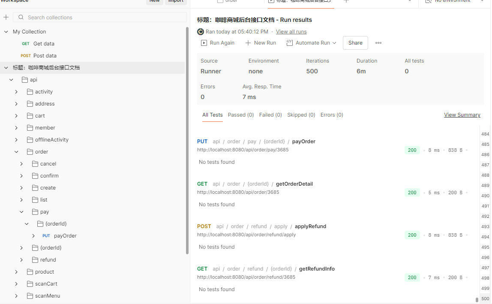

postman订单接口500次 测试

单用户连续500次的 订单接口测试 全部返回正常 但这个测试只能说明 接口调用正常  单次请求速度可以   不能说明并发状态下可以
postman 只能单次请求的测试  并发的不可以
总体来说  稳定性还可以

脚本测试
并发：10
持续时间：60 秒
总请求：48,229
成功率：100%
吞吐量：803.82 请求/秒
平均响应：12.41 ms
P50：10.76 ms
P95：23.86 ms
P99：31.63 ms
最大响应：82.88 ms
无 HTTP 错误、业务错误、超时或连接失败
商品搜索的 40 个并发请求中，30 个成功、10 个被限流，符合系统每分钟 30 次的限流配置
查询接口进行了真实并发压测；订单、购物车、地址、扫码订单等写接口执行了完整功能流程。微信登录、头像上传、二维码生成等依赖微信或外部存储的接口已跳过，并记录了原因。
当前后端在本机 10 并发、60 秒的读请求压力下表现稳定，吞吐量约 803.82 请求/秒，P95 为 23.86 ms，未发现接口错误或超时。本结果只证明 10 并发水平稳定，不代表系统最大承载能力；
商品搜索限流：40个并发请求中30个通过，10个被限流，符合限流配置
钱包在线充值：接口按设计返回“暂未开放”
测试的账号我用我自己的微信token 钱包余额为零，所以普通订单和扫码订单支付被正确拒绝为“余额不足”，所以退款申请也只能验证状态保护逻辑，没有验证成功退款链路。

测试的脚本已被我删除，只做了测试结果的保留