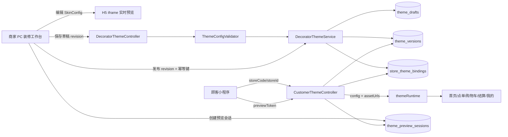

# Coffee 项目代码目录与个性化皮肤实现说明

> 文档依据：当前仓库源码（2026-08-17）  
> 适用工程：`coffee-mall-admin` 后端与 `Ruoyi-AbuCoder-UniApp-WX` 顾客端  
> 目的：说明项目代码分层、个性化皮肤核心代码位置，以及从商家编辑到顾客端生效的完整实现链路。

## 1. 项目整体结构

本项目不是单一前端工程，而是由一个 Spring Boot 管理后台/接口服务和一个 uni-app 小程序工程共同组成：

```text
coffee/
├─ pom.xml                              # Maven 配置，后端工程入口
├─ src/
│  ├─ main/
│  │  ├─ java/com/ruoyi/                # Spring Boot Java 源码
│  │  │  ├─ common/                     # 通用常量、异常、工具类
│  │  │  ├─ framework/                  # Shiro、MyBatis、Web、数据源等框架层
│  │  │  ├─ system/                     # 用户、角色、菜单、字典、配置等系统模块
│  │  │  └─ project/coffee/             # 咖啡商城业务代码
│  │  └─ resources/
│  │     ├─ mybatis/                    # MyBatis XML
│  │     ├─ schema/                     # JSON Schema 等协议定义
│  │     ├─ static/                     # 若依 PC 管理端静态资源
│  │     ├─ templates/                  # Thymeleaf 页面
│  │     └─ application.yml             # 后端配置
│  └─ test/                             # 后端测试
├─ RuoYi-AbuCoder-UniAppWx/
│  └─ Ruoyi-AbuCoder-UniApp-WX/
│     ├─ api/                           # 小程序请求封装
│     ├─ components/                    # 业务与主题组件
│     ├─ pages/                         # 首页、点单、购物车、订单、我的等页面
│     ├─ skin/                          # 对外 SkinManager/SkinResolver 门面
│     ├─ theme/                         # 皮肤运行时、规范化、注册表、Token
│     ├─ static/skin/                   # 内置皮肤位图素材
│     ├─ styles/                        # 全局设计 Token 样式
│     ├─ main.js                        # Vue 启动与全局主题 mixin 注册
│     └─ App.vue                        # 小程序生命周期与系统明暗主题监听
├─ sql/                                 # 业务建表、装修平台迁移和初始化数据
├─ docs/                                # 项目设计与开发文档
├─ scripts/                             # 浏览器检查、图片检查和辅助脚本
├─ uploadPath/                          # 本地上传文件目录，不属于业务源码
├─ target/                              # Maven 构建产物，不应手工修改
└─ logs/                                # 运行日志，不应手工修改
```

后端 `src/main/java/com/ruoyi/project/coffee/` 按业务域拆分，主要包括商品 `product`、购物车 `cart`、订单 `order`、会员 `member`、钱包 `wallet`、营销 `activity`、扫码点单 `scanOrder`、图片处理 `image` 和装修平台 `decorator`。个性化皮肤的后端核心集中在 `decorator`，不在通用 `framework` 中。

## 2. “个性化皮肤”具体指什么

本项目中的个性化皮肤是“商家/门店装修主题”，不是若依 PC 后台登录用户选择的界面皮肤。

- `src/main/resources/static/css/skins.css` 和 `src/main/resources/templates/skin.html` 属于若依后台自身的界面换色。
- `src/main/java/com/ruoyi/project/coffee/decorator/`、小程序 `theme/` 和 `skin/` 才是本项目的商家个性化皮肤功能。

该功能坚持“配置驱动、布局锁定”：商家可以修改白名单颜色、背景素材、文字视觉参数、组件 Variant 和少量受限文案，但不能写入坐标、宽高、布局、WXML、CSS 或 JavaScript。商品、价格、库存、购物车和订单等业务数据仍由原业务接口提供。

## 3. 核心代码快速定位

| 职责 | 核心文件 | 说明 |
|---|---|---|
| PC 装修工作台页面 | `src/main/resources/templates/coffee/decorator/workbench.html` | 主题/门店选择、配置编辑、素材选择、自动保存、H5 实时预览、发布和版本恢复 |
| 工作台页面入口 | `src/main/java/com/ruoyi/project/coffee/decorator/api/DecoratorWorkbenchController.java` | 返回工作台模板并注入安全的 H5 预览地址 |
| 商家装修 API | `src/main/java/com/ruoyi/project/coffee/decorator/api/DecoratorThemeController.java` | 草稿、校验、发布、版本、门店独立主题和预览会话接口 |
| 顾客端主题 API | `src/main/java/com/ruoyi/project/coffee/decorator/api/CustomerThemeController.java` | 按门店返回已发布主题，或按预览 Token 返回草稿快照 |
| 主题核心业务 | `src/main/java/com/ruoyi/project/coffee/decorator/theme/DecoratorThemeService.java` | 创建主题、乐观锁保存、发布版本、回滚、商家/门店绑定 |
| 真机预览业务 | `src/main/java/com/ruoyi/project/coffee/decorator/theme/DecoratorPreviewService.java` | 创建短期 Token、保存不可变草稿快照、解析和撤销预览 |
| 配置安全校验 | `src/main/java/com/ruoyi/project/coffee/decorator/theme/ThemeConfigValidator.java` | 字段白名单、范围、素材、组件 Variant、危险字段和大小校验 |
| 默认皮肤 | `src/main/java/com/ruoyi/project/coffee/decorator/theme/SkinConfigDefaults.java` | 后端创建新主题时使用的完整默认配置 |
| 素材服务 | `src/main/java/com/ruoyi/project/coffee/decorator/asset/DecoratorAssetService.java` | 上传、归档、租户检查、引用快照和素材 URL 映射 |
| 租户与权限 | `src/main/java/com/ruoyi/project/coffee/decorator/context/` | 当前商家、可访问门店及角色权限的解析和拦截 |
| 数据访问接口 | `src/main/java/com/ruoyi/project/coffee/decorator/mapper/` | 装修主题、成员关系和素材 Mapper |
| SQL 实现 | `src/main/resources/mybatis/coffee/decorator/` | 草稿、版本、门店绑定、预览和素材查询 |
| 配置协议 | `src/main/resources/schema/theme-config-v1.schema.json` | SkinConfig V1 和旧 ThemeConfig V1 的结构定义 |
| 小程序运行时核心 | `RuoYi-AbuCoder-UniAppWx/Ruoyi-AbuCoder-UniApp-WX/theme/runtime.js` | 加载、缓存、应用配置、解析素材和向页面提供全局 mixin |
| 配置兼容与兜底 | `RuoYi-AbuCoder-UniAppWx/Ruoyi-AbuCoder-UniApp-WX/theme/normalize.js` | 把服务端配置规范化，并兼容旧 `tokens/components/slots` 格式 |
| 组件白名单 | `RuoYi-AbuCoder-UniAppWx/Ruoyi-AbuCoder-UniApp-WX/theme/skin-registry.js` | 可换背景组件、页面、逻辑尺寸和拉伸方式的唯一前端注册表 |
| 字体角色白名单 | `RuoYi-AbuCoder-UniAppWx/Ruoyi-AbuCoder-UniApp-WX/theme/typography-registry.js` | 21 个文字角色及允许的字号、字重等范围 |
| 前端默认/内置主题 | `RuoYi-AbuCoder-UniAppWx/Ruoyi-AbuCoder-UniApp-WX/theme/defaults.js` | 默认主题、兼容模板及 `vintage`、`midnight` 本地皮肤 |
| 小程序主题请求 | `RuoYi-AbuCoder-UniAppWx/Ruoyi-AbuCoder-UniApp-WX/api/theme.js` | 获取门店已发布主题、版本号和预览主题 |
| PC/H5 预览通信 | `RuoYi-AbuCoder-UniAppWx/Ruoyi-AbuCoder-UniApp-WX/theme/preview-bridge.js` | `postMessage` 配置更新、页面切换和点击反向定位 |
| 对外皮肤门面 | `RuoYi-AbuCoder-UniAppWx/Ruoyi-AbuCoder-UniApp-WX/skin/manager.js`、`skin/resolver.js` | 为业务组件提供稳定入口，实际状态仍统一由 `themeRuntime` 管理 |
| 数据库初始化 | `sql/coffee_theme_decorator.sql` | 装修平台完整表结构、基础插槽、模板和菜单数据 |
| Skin V1 增量 | `sql/coffee_skin_v1.sql` | 组件背景插槽与 SkinConfig 模板升级 |
| 主题范围升级 | `sql/coffee_theme_scope_v2.sql` | 多装修方案及商家/门店范围相关迁移 |

建议第一次阅读时按以下顺序：`workbench.html` -> `DecoratorThemeController` -> `DecoratorThemeService` -> `ThemeConfigValidator` -> `theme.js` -> `runtime.js` -> 一个实际页面（例如 `pages/index/index.vue`）。

## 4. 端到端实现链路



### 4.1 商家进入工作台

1. 浏览器访问 `/coffee/decorator/workbench`，`DecoratorWorkbenchController` 返回 Thymeleaf 页面。
2. 工作台通过 `/coffee/decorator/context/merchants` 获取当前用户的商家成员关系。
3. 用户选择商家后调用 `/coffee/decorator/context/select`，后端把商家 ID 写入 Shiro Session。
4. `TenantContextInterceptor` 拦截后续 `/coffee/decorator/**` 请求，建立 `TenantContext`。
5. `TenantContextService` 根据 `merchant_members` 和门店授权关系判断角色、商家和门店范围。

角色能力在 `TenantContextService.permissionsFor()` 中定义。`OWNER/ADMIN` 拥有全部装修权限；`DESIGNER` 可以编辑和预览但不能发布；`OPERATOR` 主要管理素材；`VIEWER` 只读。前端按钮隐藏只改善体验，真正的权限边界在后端。

### 4.2 编辑和实时预览

1. 工作台读取系统模板、装修方案和当前草稿。
2. 用户修改颜色、文字、素材或组件配置后，页面内状态 `state.config` 更新。
3. `postH5Preview()` 向 uni-app H5 iframe 发送：

```js
{
  type: 'SKIN_CONFIG_UPDATE',
  payload: state.config,
  assetUrls: { '素材ID': '可访问URL' }
}
```

4. 小程序 `theme/preview-bridge.js` 校验消息来源后调用 `themeRuntime.apply(..., { preview: true, persist: false })`。
5. iframe 内点击带 `data-skin-component` 或 `data-text-role` 的节点时，会回传 `SKIN_EDITOR_SELECT`，工作台据此定位对应编辑器。
6. 工作台切换预览页时发送 `SKIN_PREVIEW_NAVIGATE`，预览端只允许跳转到预先注册的首页、点单、购物车、结算和“我的”页面。

这条链路只更新内存，不写数据库，也不会影响顾客线上主题。

### 4.3 保存草稿

工作台调用：

```http
PUT /coffee/decorator/themes/{themeId}/draft
```

请求携带当前 `revision` 和完整 `config`。`DecoratorThemeService.saveDraft()` 依次完成：

1. 校验当前租户对该主题具有编辑权限；
2. 使用 `ThemeConfigValidator` 校验并规范化 JSON；
3. 校验所有数字素材 ID 属于当前商家且状态可用；
4. 使用 `revision` 进行乐观锁更新；
5. 更新 `theme_asset_refs` 草稿素材引用快照；
6. 返回递增后的草稿 revision。

如果其他窗口已经保存，更新行数为 0，接口返回 `THEME_DRAFT_CONFLICT`，不会静默覆盖。工作台当前在修改停止 800 ms 后触发自动保存。

### 4.4 发布主题

工作台先校验并保存草稿，然后调用：

```http
POST /coffee/decorator/themes/{themeId}/publish
```

发布请求包含 `revision`、`idempotencyKey` 和可选 `publishNote`。`DecoratorThemeService.publish()` 在同一事务中：

1. 校验 `THEME_PUBLISH` 权限；
2. 用幂等键避免重复发布；
3. 对草稿行加锁并再次核对 revision；
4. 再次执行配置和素材引用校验；
5. 生成规范 JSON 的 SHA-256，拒绝发布与最新版本完全相同的内容；
6. 向 `theme_versions` 写入不可变版本；
7. 写入该版本的素材引用快照；
8. 商家统一主题更新所有 `FOLLOW_MERCHANT` 门店，门店主题只更新对应 `INDEPENDENT` 门店；
9. 返回版本号和受影响门店数量。

“恢复历史版本”不是修改旧版本，而是把历史快照复制回草稿，之后仍需重新发布。

### 4.5 顾客端加载已发布主题

小程序页面最终通过 `themeRuntime.loadPublished(storeCode)` 加载皮肤。首选统一接口为：

```http
GET /api/mini/skin?storeId={storeCode}
```

返回结构的关键字段是：

```json
{
  "source": "ACTIVE",
  "themeId": "1",
  "versionId": "12",
  "versionNo": 3,
  "storeCode": "STORE_001",
  "config": {},
  "assetUrls": {
    "101": "/profile/upload/2026/08/example.png"
  }
}
```

运行时处理流程如下：

1. 门店发生切换时，先清除上一门店的内存主题，防止请求失败后串用皮肤。
2. 读取本地 `skin_config`、`skin_version` 和 `skin_store_code` 缓存。
3. 请求服务端主题；版本未变化时可复用配置，但仍刷新素材 URL。
4. `normalizeSkinConfigV1()` 为缺失或非法字段填入默认值，并兼容旧版配置。
5. 数字素材 ID 通过 `assetUrls` 转成 URL；内置字符串 URL 直接解析。
6. `themeMixin` 把页面变量、组件背景、文字 Token 等方法注入所有 Vue 组件。
7. 网络或配置异常时保留当前门店缓存或默认皮肤，业务页面仍可使用。

### 4.6 真机预览未发布草稿

工作台通过 `/themes/{themeId}/preview-sessions` 创建预览会话。后端保存当时的草稿 JSON 快照和素材引用，并返回 `previewToken` 与小程序路径：

```text
/pages/decorator-preview/index?previewToken={token}
```

小程序转入首页后调用 `themeRuntime.loadPreview()`，统一主题接口优先解析 Token，并返回 `source: PREVIEW`。预览配置不写入本地持久缓存，避免退出预览后污染正常主题。

后端 `DecoratorPreviewService` 当前有效期常量是 30 分钟；工作台弹窗文字仍显示 15 分钟，两处需要统一后再把具体时长作为产品承诺。

## 5. SkinConfig V1 配置模型

当前规范皮肤使用数字 `schemaVersion: 1`。主要字段如下：

| 字段 | 用途 |
|---|---|
| `schemaVersion` | 配置协议版本，当前为 `1` |
| `themeVersion` | 皮肤内容版本 |
| `page` | 页面背景、主文字色和次文字色 |
| `colors` | 全局主色、卡片色和文字色 Token |
| `content.homeBanner` | Banner 显隐、标题和副标题；属于受限文案 |
| `assets` | 注册组件的背景素材；值可以是素材 ID、受支持 URL 或 `null` |
| `productImages` | 按商品 ID 覆盖商品主图，最多处理 200 个映射 |
| `typography` | 21 个文字角色的颜色、字号、字重、行高等 |
| `slots` | 旧版首页卡片/TabBar 配置，当前仍保留读取兼容 |

后端还兼容字符串 `schemaVersion: "1.0.0"` 的旧 `tokens/brand/components` 配置。新功能应写入规范 SkinConfig，不应继续扩展旧格式。

### 5.1 当前组件背景注册表

源码当前包含 11 个 `assets` 组件键：

| 页面 | 键 | 渲染位置/组件 | 素材适配 |
|---|---|---|---|
| 首页 | `homeBanner` | `pages/index/index.vue` | `cover`，支持最多 10 张轮播图 |
| 首页 | `actionCard` | `pages/index/index.vue` | 拉伸填充 |
| 首页 | `sectionBanner` | `pages/index/index.vue` | 拉伸填充 |
| 首页 | `aboutImage` | `pages/index/index.vue` | `contain` |
| 点单 | `productCard` | `components/immersive-product-card.vue` | 拉伸填充 |
| 点单 | `specPanel` | `components/product-card-back.vue` | 拉伸填充 |
| 购物车 | `emptyCart` | `pages/cart/cart.vue` | 拉伸填充 |
| 购物车 | `cartPanel` | `pages/cart/cart.vue` | 拉伸填充 |
| 确认订单 | `checkoutBar` | `pages/order/confirm.vue` | 拉伸填充 |
| 我的 | `memberCard` | `pages/me/me.vue` | 拉伸填充 |
| 全局 | `tabBar` | `components/theme/theme-tab-bar.vue` | 拉伸填充 |

此外，工作台提供 `productImages` 商品主图映射编辑，它存放在独立的 `productImages` 对象中，不属于上述 11 个背景键。

组件尺寸、页面归属、适配方式和可关联文字角色以小程序 `theme/skin-registry.js` 为准。`docs/skin-component-registry.md` 仍写着 10 个背景组件，尚未计入后加的 `aboutImage`，维护时应同步更新。

### 5.2 安全边界

`ThemeConfigValidator` 是服务端最终安全边界，主要限制包括：

- 配置 JSON 最大 64 KiB；
- 组件键、文字角色和 Variant 必须在白名单中；
- 颜色、字号、字重、行高、透明度和渐变停靠点必须在规定范围内；
- 首页 Banner 最多 10 张，标题最多 40 字，副标题最多 60 字；
- 素材 ID 必须是正整数，并由素材服务再次校验租户、用途和状态；
- 递归拒绝 `x/y/left/right/top/bottom/position/width/height/margin/padding/transform/flex/grid`；
- 拒绝 `css/wxml/javascript/script` 等可执行或任意样式字段。

因此，不能只改前端工作台放宽输入；服务端、Schema 和运行时必须保持一致。

## 6. 小程序页面如何使用皮肤

`main.js` 执行三件关键工作：注册全局 `themeMixin`、恢复本地主题缓存、安装 H5 装修预览桥。页面最常见的接入方式是：

```vue
<view class="page" :style="themePageStyle">
  <view
    data-skin-component="cartPanel"
    :style="themeSkinAssetStyle('cartPanel')"
  >
    <text data-text-role="price">¥{{ payPrice }}</text>
  </view>
</view>
```

- `themePageStyle`：输出全局颜色、背景和字体 CSS 变量。
- `themeSkinAssetStyle(key)`：把组件素材解析成背景样式。
- `themeSkinAsset(key)` / `themeSkinAssets(key)`：返回单张/多张图片 URL。
- `themeSkinProductImage(productId)`：读取商品主图覆盖。
- `themeTypographyToken(role)`：读取指定文字角色。
- `data-skin-component`、`data-text-role`：供 H5 预览点击反向定位，不承载业务逻辑。

已接入的主要页面为：

- `pages/index/index.vue`：首页背景、轮播 Banner、功能卡片、分区图和关于我们图；
- `pages/scan/menu.vue`：点单页和商品卡片；
- `pages/cart/cart.vue`：空购物车和结算面板；
- `pages/order/confirm.vue`：订单确认底栏；
- `pages/me/me.vue`：会员卡；
- `components/theme/theme-tab-bar.vue` 与 `components/bottom-tab-bar.vue`：全局底部导航。

## 7. 数据库结构与关系

装修平台核心表位于 `sql/coffee_theme_decorator.sql`：

| 表 | 职责 |
|---|---|
| `merchants` | 商家租户 |
| `merchant_members` | 后台用户与商家角色关系 |
| `stores` | 商家门店及对外 `store_code` |
| `merchant_member_stores` | 成员可访问门店范围 |
| `system_theme_templates` | 系统主题模板 |
| `themes` | 商家级或门店级装修方案元数据 |
| `theme_drafts` | 每个主题当前可变草稿，包含 revision 乐观锁 |
| `theme_versions` | 不可变发布快照、哈希、版本号和幂等键 |
| `store_theme_bindings` | 门店当前跟随模式、主题和线上版本 |
| `assets` | 系统/商家素材及文件元数据 |
| `theme_asset_refs` | 草稿、版本、模板对素材的可查询引用 |
| `component_background_slots` | 平台维护的组件图片规格与渲染模式 |
| `theme_preview_sessions` | 有效期内的预览 Token 和草稿快照 |
| `ai_generation_tasks/results` | 受约束的 AI 素材生成任务与候选结果 |

关系可以概括为：一个商家有多个门店和多个装修方案；一个装修方案有一个当前草稿和多个发布版本；每个门店通过 `store_theme_bindings` 指向当前线上版本。门店选择 `FOLLOW_MERCHANT` 时随商家统一主题发布更新，选择 `INDEPENDENT` 时维护自己的门店主题。

## 8. 主要 API 一览

### 8.1 商家工作台接口

统一前缀：`/coffee/decorator`

| 方法 | 路径 | 用途 |
|---|---|---|
| `GET` | `/stores` | 当前成员可访问门店 |
| `GET` | `/templates` | 系统模板 |
| `GET` | `/themes?scopeType=&scopeId=` | 指定范围内的装修方案 |
| `POST` | `/themes` | 从默认值、模板、活动版本或其他方案创建新方案 |
| `GET/PUT` | `/themes/{id}/draft` | 获取/保存草稿 |
| `POST` | `/themes/{id}/validate` | 发布前校验 |
| `POST` | `/themes/{id}/publish` | 发布不可变版本 |
| `GET` | `/themes/{id}/versions` | 版本历史 |
| `POST` | `/themes/{id}/versions/{versionId}/restore` | 恢复历史版本到草稿 |
| `POST` | `/themes/{id}/preview-sessions` | 创建真机预览 |
| `DELETE` | `/preview-sessions/{id}` | 立即撤销预览 |
| `POST` | `/stores/{id}/independent-theme` | 从当前线上版本复制门店独立主题 |
| `POST` | `/stores/{id}/follow-master` | 门店重新跟随商家统一主题 |
| `GET/POST/DELETE` | `/assets` | 素材查询、上传和归档 |

### 8.2 顾客端接口

| 方法 | 路径 | 用途 |
|---|---|---|
| `GET` | `/api/mini/skin?storeId=&previewToken=` | 统一主题读取接口，Token 存在时预览优先 |
| `GET` | `/api/wx/stores/{storeCode}/skin` | 已发布皮肤兼容接口 |
| `GET` | `/api/wx/stores/{storeCode}/skin/version` | 只读取已发布版本号 |
| `GET` | `/api/wx/skin/preview?token=` | 预览主题兼容接口 |

## 9. 扩展一个新皮肤组件时需要改什么

新增组件不能只在 Vue 页面写一个背景字段，至少需要同步完成以下工作：

1. 在 `theme/skin-registry.js` 添加组件键、页面、逻辑尺寸、适配方式和文字角色。
2. 在 `theme/defaults.js` 和后端 `SkinConfigDefaults.java` 添加默认值。
3. 在 `theme/normalize.js` 确保新字段能被规范化和兜底。
4. 在目标 Vue 节点添加 `data-skin-component`，并消费 `themeSkinAssetStyle()` 或 `themeSkinAsset()`。
5. 在 `workbench.html` 注册组件并提供编辑控件、规格说明和页面定位。
6. 在 `ThemeConfigValidator.java` 与 `theme-config-v1.schema.json` 添加同一白名单键。
7. 如果需要上传/AI 生成的固定规格，在 `component_background_slots` SQL 中添加插槽，并同步素材用途校验。
8. 更新 `docs/skin-component-registry.md`，补充后端校验、运行时和页面测试。

任何一个注册表遗漏都会造成“工作台能编辑但后端拒绝”“发布成功但页面不显示”或“素材被当成无效引用”等问题。

## 10. 测试与排查入口

后端专项测试位于 `src/test/java/com/ruoyi/project/coffee/decorator/`：

- `ThemeConfigValidatorTest`：协议白名单、边界值、危险字段、轮播和商品图；
- `DecoratorThemeServiceTest`：草稿冲突、幂等发布、版本和门店绑定；
- `DecoratorPreviewServiceTest`：Token、快照、过期和小程序码降级；
- `DecoratorAssetServiceTest`：上传限制、租户边界和引用保护；
- `CustomerThemeControllerTest`：顾客端返回契约；
- `DecoratorWorkbenchControllerTest`：H5 预览 URL 安全性。

常用验证命令：

```powershell
mvn "-Dtest=ThemeConfigValidatorTest,DecoratorThemeServiceTest,DecoratorPreviewServiceTest,DecoratorAssetServiceTest,CustomerThemeControllerTest,DecoratorWorkbenchControllerTest" test
Set-Location RuoYi-AbuCoder-UniAppWx\Ruoyi-AbuCoder-UniApp-WX
npm run build:h5
```

排查时优先确认以下状态：

1. 当前 Shiro Session 是否已选择正确商家；
2. 当前用户是否有主题/门店权限；
3. 工作台草稿 revision 是否为最新；
4. 配置是否通过服务端白名单校验；
5. 素材 ID 是否属于当前商家且未归档；
6. 门店绑定是否指向预期 `published_version_id`；
7. 小程序本地缓存的 `skin_store_code` 是否与当前门店一致；
8. 接口返回的 `assetUrls` 是否包含配置引用的数字素材 ID。

## 11. 相关文档

- `docs/skin-component-registry.md`：组件、文字角色、素材规格和 AI 边界的专项说明；
- `docs/features/user-theme/MERCHANT_DECORATOR_DEVELOPMENT.md`：装修平台的产品范围、架构决策和完整开发基线。

当文档与代码不一致时，当前行为应以 `ThemeConfigValidator.java`、`theme/skin-registry.js`、`theme/runtime.js` 和数据库 Mapper 为准，并尽快反向更新文档与 Schema。
