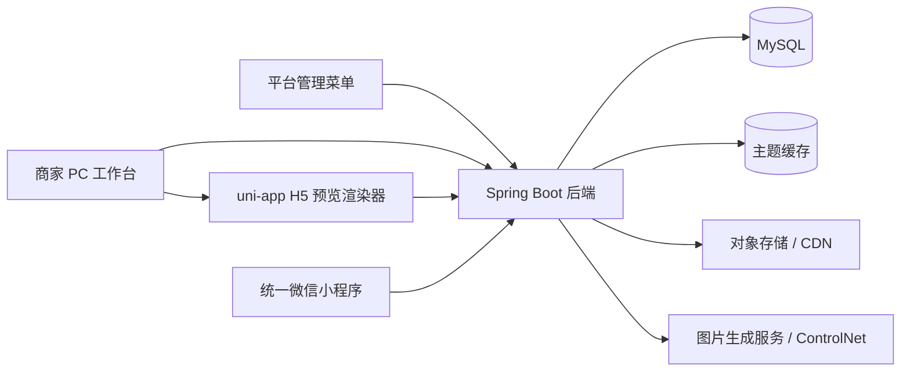
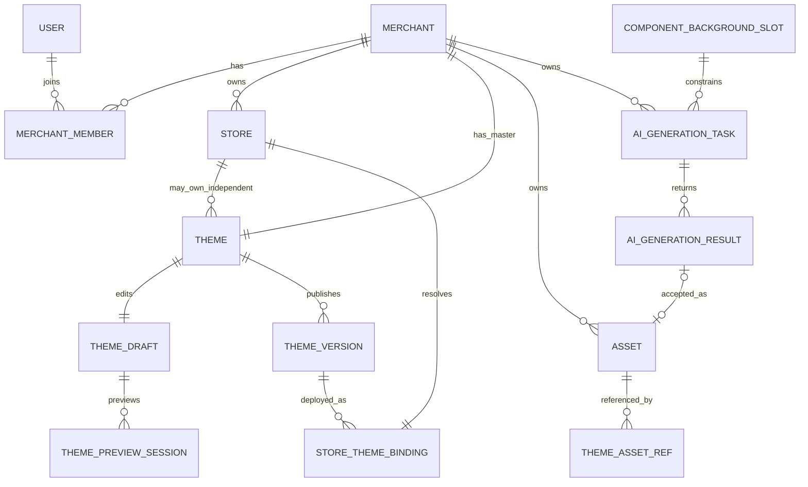
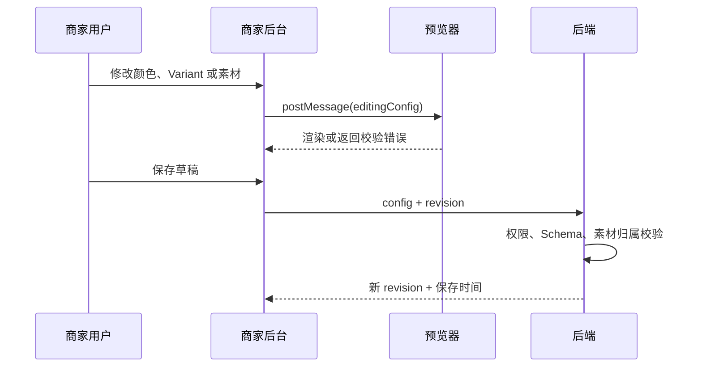
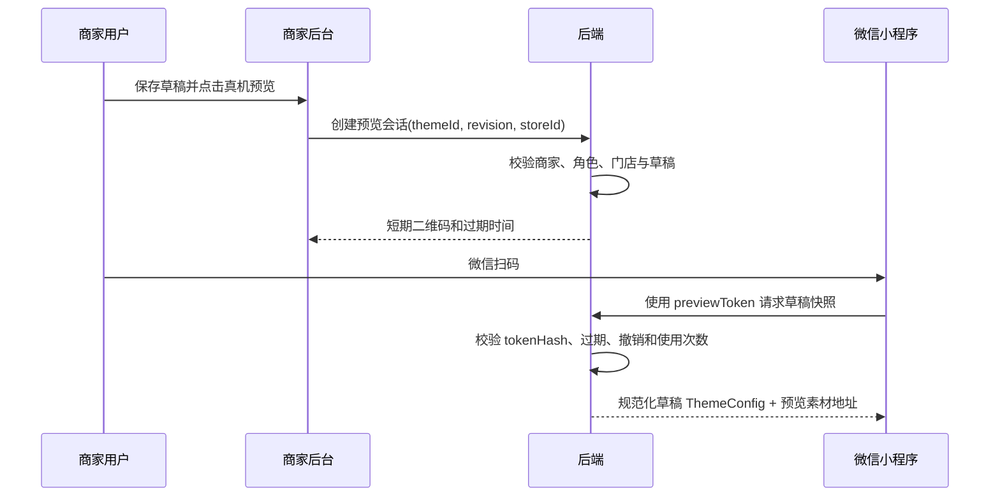
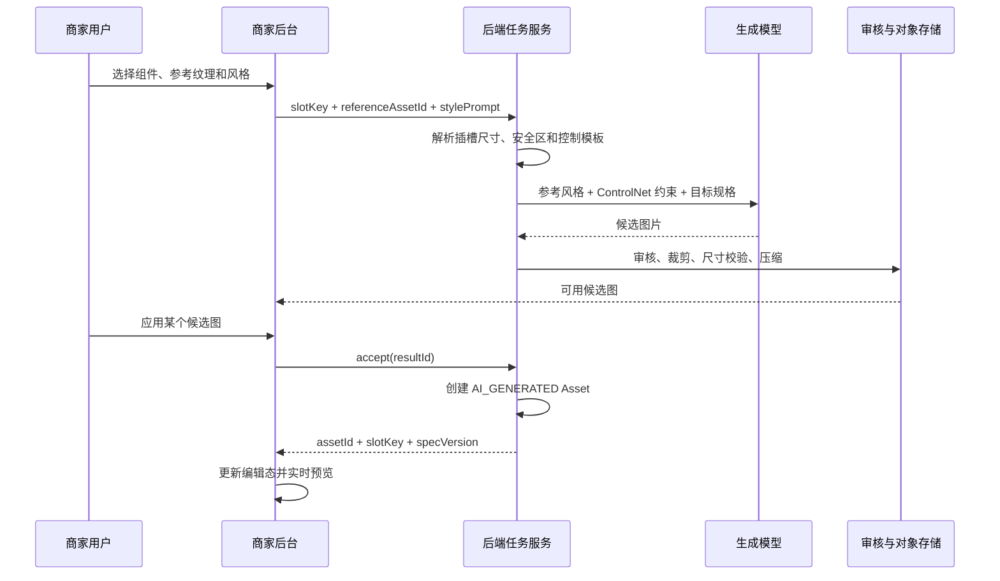

# 商家小程序可视化装修平台开发文档

> 文档状态：开发基线草案  
> 文档版本：V1.2
> 更新日期：2026-08-14
> 适用项目：coffee-mall-admin / Ruoyi-AbuCoder-UniApp-WX

## 1. 文档目的

本文档将“面向商家的微信小程序可视化装修平台”拆成可以进入设计、开发和测试的技术基线，明确产品边界、系统职责、数据模型、ThemeConfig、API、权限、发布流程、AI 边界与开发顺序。

本文不是最终 UI 设计稿，也不替代后续 JSON Schema、数据库迁移脚本和接口字段级定义。发生冲突时，应先更新本文档中的产品与架构决策，再修改实现。

组件化 SkinConfig V1 的 10 个背景组件、21 个文字角色、首页 Banner 受限文案、字段白名单和预览消息协议已经冻结，详见 `docs/skin-component-registry.md`。新协议使用 `colors/content/assets/typography`，同时保留对既有 `slots` 和 `tokens/components` 配置的读取兼容；商家配置仍不得包含任何坐标、宽高或布局字段。

## 2. 已确认决策与当前假设

### 2.1 已确认决策

1. 顾客端使用平台统一的微信小程序 AppID，不为每个商家创建独立 AppID。
2. 顾客通过扫码、分享入口或门店选择进入平台小程序中的某个商家门店。
3. 每个门店均可独立配置装修方案，商家可根据不同门店的经营特色，自定义页面样式、主题、图片及展示内容，使各门店拥有独立的店铺形象。
4. 门店可以从商家统一方案复制出独立方案；复制后独立维护，不再自动继承商家方案的后续修改。
5. MVP 采用“视觉换肤 + 有限组件样式”：支持设计系统规定的 Variant 和少量非核心模块显隐。
6. MVP 不支持自由拖拽、任意排序、任意坐标、商家自定义 WXML/WXSS/JavaScript。
7. ControlNet 只可用于生成受约束的图片素材，不参与页面布局、代码生成或 ThemeConfig 生成执行。
8. 平台管理员与商家成员共用现有 PC Web 管理应用及登录入口，但登录后按身份进入不同菜单和数据空间；商家不得使用平台 `admin` 超级账号。
9. 装修编辑器只在商家 PC Web 工作台提供；顾客小程序展示已发布主题，并通过短期预览凭证支持商家真机查看未发布草稿。
10. AI 生图按“组件背景插槽”工作：组件规格决定目标尺寸、比例、渲染模式和文字安全区，AI 提取参考图纹理/风格并按该规格生成。
11. ThemeConfig 只引用已入库的组件背景 assetId 和 slotKey；生成候选图不会直接影响草稿或线上版本。

### 2.2 根据现有仓库确认的事实

1. 后端为 Spring Boot 2.5.13、Java 8、MyBatis、Shiro、Thymeleaf、MySQL。
2. 顾客端为 uni-app，已经存在首页、商城、扫码点单、购物车、订单和个人中心等业务页面。
3. 项目已经存在商品、订单、营销、会员、钱包、扫码点单和 AI 图片处理能力。
4. 本项目应改造既有页面以消费 ThemeConfig，不重复开发交易业务。

### 2.3 暂定假设

以下内容在开发前可调整，但当前按此拆分任务：

1. 组件背景 AI 属于 MVP 后半阶段增强项，不阻塞基础装修、预览和发布闭环验收。
2. 第一版开放 `shopHeader.background`、`activityBanner.background`、`productCard.background` 三个组件背景插槽；其他组件仅使用 Token 或系统素材。
3. MVP 中一个商家只有一套正在使用的商家统一主题；一个门店最多有一套正在使用的独立主题。
4. 系统主题模板不少于 3 套，具体视觉稿、Variant 名称及素材尺寸由设计阶段冻结。
5. 组件背景生成支持从商家参考素材提取纹理/风格；Provider 能力不足时，使用系统参考模板与文字描述作为降级方案。

## 3. 产品定位

### 3.1 要解决的问题

平台内不同咖啡商家共用同一套小程序代码，但需要呈现各自品牌视觉。当前若通过复制页面或修改代码完成定制，会导致发布成本高、版本分叉、难以维护和数据串用风险。

本系统使用统一 ThemeConfig 驱动既有小程序组件，使商家无需编写代码即可完成有限且安全的品牌装修，并通过草稿、预览、发布和历史版本保证线上稳定。

### 3.2 核心用户

| 用户 | 核心诉求 |
|---|---|
| 商家 Owner / Admin | 统一管理品牌装修、门店和发布 |
| Designer | 调整主题、组件样式与素材并保存草稿 |
| Operator | 上传、生成和维护运营素材 |
| Viewer | 查看装修效果与发布记录 |
| 平台管理员 | 维护系统模板、公共素材、商家状态和安全规则 |
| 顾客 | 在统一小程序中看到当前门店已发布且稳定的品牌主题 |

### 3.3 成功标准

MVP 完成后应满足：

1. 至少 3 套系统模板可以驱动同一套组件形成明显不同的视觉效果。
2. 商家修改颜色、品牌素材或组件 Variant 后，后台预览即时变化。
3. 保存草稿不影响顾客端，发布成功后顾客端才切换到新版本。
4. 商家统一主题发布后，仍跟随统一主题的门店一起更新；独立门店不受影响。
5. 任意跨商家读取、编辑、素材引用和版本操作均被后端拒绝。
6. 商家能在 PC 后台实时预览，并能用短期二维码在微信小程序真机查看当前草稿。
7. AI 生成图片必须符合所选组件背景插槽的比例、输出规格和安全区，选择候选图后才可写入草稿。

## 4. MVP 范围

### 4.1 必须交付

- 商家身份、成员角色和门店访问范围识别；
- 商家与门店切换；
- 3 套系统主题模板；
- ThemeConfig V1 与服务端校验；
- 商家统一主题；
- 门店复制为独立主题、独立发布、重新跟随统一主题；
- 首页、扫码点单页、个人中心的统一 Token 接入；
- 首页主要组件 Variant；
- 点单页商品卡片 Variant；
- 个人中心品牌头部 Variant；
- 非核心营销模块的有限显隐；
- Logo、头图、Banner、背景和纹理素材上传；
- 商家私有素材库与系统公共素材；
- 编辑态实时预览；
- 短期二维码真机草稿预览；
- 自动保存或手动保存草稿；
- 发布前校验、原子发布、缓存失效；
- 不可变的发布版本与历史版本预览；
- 历史版本恢复为新草稿；
- 权限校验、租户隔离、审计日志；
- 顾客端按当前门店读取已发布主题及默认主题兜底。

### 4.2 MVP 后半阶段增强

- 3 个白名单组件背景插槽的受约束 AI 素材生成；
- 从参考素材提取纹理、配色和风格，并按插槽规格重新生成；
- 使用 ControlNet 约束背景结构和文字安全区；
- 规则式主题推荐；
- 素材裁剪焦点和多规格自动派生；
- 更完整的操作审计筛选与导出。

### 4.3 明确延后

- 自由拖拽、网格布局编辑、模块任意排序；
- 商家自定义组件、WXML、WXSS、JavaScript；
- 业务数据源绑定器；
- 商品、价格、分类、库存、订单等业务内容编辑；
- 总部主题与门店主题的字段级继承和实时合并；
- 多草稿分支、多人实时协同编辑；
- C 端用户自由换肤；
- AI 生成完整页面、代码或任意尺寸素材；
- 所有组件任意开启 AI 背景；
- 为每个商品卡片实例分别生成背景；MVP 的 `productCard.background` 应用于该主题下同类商品卡片；
- 商家直接传入任意像素尺寸、模型、采样器或 ControlNet 参数；
- 自建训练 ControlNet 或其他生成模型；
- 跨商家共享私有主题和私有素材；
- 商家独立微信小程序 AppID 及微信第三方平台代发布。

## 5. 系统上下文与职责



平台管理员与商家成员可以共用现有 RuoYi Web 应用和登录页，但不能共用账号、菜单和数据权限。平台 `admin` 账号只用于平台管理；商家通过独立 `sys_user` 登录，并由 `merchant_members` 决定其商家角色和门店范围。

MVP 不要求单独开发商家 App 或移动端编辑器。后续可将商家工作台拆到独立域名或前端应用，但不得改变 TenantContext、权限和资源归属模型。

### 5.1 商家后台职责

- 运行于 PC Web 商家工作台，根据商家角色展示装修菜单；
- 展示当前商家、当前门店、角色和门店权限范围；
- 提供主题模板选择、Token 编辑、Variant 选择和素材选择；
- 在组件设置中读取背景插槽规格，提供“上传素材 / 素材库 / AI 生成”入口；
- 维护编辑态配置并向预览器发送更新；
- 展示未保存状态、保存冲突、校验错误和发布结果；
- 提供版本历史、历史预览和“恢复为草稿”；
- 提供素材库及 AI 任务状态；
- 创建短期真机预览二维码并展示失效时间；
- 根据权限隐藏或禁用操作，但不承担最终授权判断。

### 5.2 后端职责

- 从已认证会话建立当前 TenantContext，不信任请求体中的 merchantId；
- 验证用户的商家成员关系、角色权限和门店范围；
- 保存和校验 ThemeConfig；
- 校验全部素材归属、状态、类型和用途；
- 管理草稿并发版本、不可变发布快照和门店部署关系；
- 在事务中完成发布并在提交后失效缓存；
- 只向顾客端返回指定门店当前已发布的配置；
- 管理上传、压缩、审核、停用和 AI 任务；
- 管理组件背景插槽注册表、AI 输出规格及短期预览凭证；
- 记录发布、恢复、复制、权限变更和素材停用等审计事件。

### 5.3 顾客端职责

- 从可信入口解析结果中获得当前门店上下文；
- 获取当前门店的已发布 ThemeConfig；
- 将 Token 和 Variant 传给固定业务组件；
- ThemeConfig 缺失、版本过新或解析失败时使用内置默认主题；
- 不执行配置中的代码，不直接使用任意外部 URL。
- 在普通模式下只读取已发布版本；仅在合法、未过期的预览凭证下读取指定草稿 revision。

### 5.4 预览器职责

推荐将 uni-app 编译为独立 H5 预览入口并嵌入后台 iframe，复用小程序端的主题解析器、Token 默认值和组件 Variant。预览器使用固定的演示业务数据，不写入商品、订单等业务表。

后台通过 `postMessage` 发送尚未保存的编辑态配置。预览器必须校验消息来源，并按与顾客端相同的 ThemeConfig Schema 渲染。

预览分为两类：

1. **后台即时预览**：iframe 直接接收浏览器内编辑态，不要求先保存；
2. **微信真机预览**：必须先保存草稿，再由后端创建短期、不透明、可撤销的 previewToken。Token 绑定 merchantId、storeId、themeId、draftRevision、创建人和过期时间，小程序不能通过传入任意 themeId/versionId 读取草稿。

## 6. 商家、门店、主题、版本与素材关系



### 6.1 关系规则

1. `merchant` 是私有业务数据隔离的基础单位。
2. 商家统一主题的 `scope_type` 为 `MERCHANT`，`owner_store_id` 为空。
3. 门店独立主题的 `scope_type` 为 `STORE`，`owner_store_id` 必填。
4. 门店绑定模式为 `FOLLOW_MERCHANT` 或 `INDEPENDENT`。
5. 门店复制独立主题时复制完整 ThemeConfig，不建立运行时继承关系。
6. `cloned_from_theme_id` 和 `cloned_from_version_id` 仅用于追溯，不能用于配置合并。
7. 一个主题只有一个可变工作草稿，可以有多个不可变发布版本。
8. 素材默认归商家所有，可供该商家下所有门店使用；`store_id` 仅作为来源或筛选信息时不得充当唯一授权条件。
9. 系统公共素材使用 `scope_type=SYSTEM`，不得伪装成商家素材。
10. 组件背景尺寸来自系统 `component_background_slots`，不从商家请求或参考图尺寸推断。
11. 参考图只提供纹理、配色和风格信息；ControlNet 模板约束装饰区域与文字安全区。
12. AI 候选结果被商家接受并通过审核后才转为 Asset；未接受候选图不能写入 ThemeConfig。

### 6.2 门店独立与重新跟随

“复制为门店独立装修”流程：

1. 读取门店当前生效的发布版本；
2. 创建 `scope_type=STORE` 的 Theme；
3. 将当前配置复制到该 Theme 的草稿；
4. 门店线上绑定暂时不变；
5. 独立主题首次发布成功时，绑定原子切换为 `INDEPENDENT`。

“重新使用商家统一装修”流程：

1. 用户确认切换影响；
2. 将门店绑定切回统一主题当前发布版本；
3. 保留原独立 Theme 及历史版本，但标记为非当前使用；
4. 不删除素材，不覆盖独立主题历史。

## 7. 核心数据模型

表名可按项目命名规范增加 `t_` 前缀，以下使用语义名称。

### 7.1 merchants

| 字段 | 说明 |
|---|---|
| id | 商家 ID |
| name | 商家名称 |
| status | ACTIVE / DISABLED |
| created_at / updated_at | 时间戳 |

### 7.2 merchant_members

| 字段 | 说明 |
|---|---|
| id | 主键 |
| merchant_id | 商家 ID |
| user_id | 后台用户 ID |
| role | OWNER / ADMIN / DESIGNER / OPERATOR / VIEWER |
| store_scope | ALL / SELECTED |
| status | ACTIVE / DISABLED |

当 `store_scope=SELECTED` 时，使用 `merchant_member_stores(member_id, store_id)` 保存可访问门店。角色权限与门店范围必须同时满足。

### 7.3 stores

| 字段 | 说明 |
|---|---|
| id | 门店 ID |
| merchant_id | 租户字段，必填 |
| store_code | 对外稳定编码，不直接暴露自增 ID |
| name | 门店名称 |
| status | ACTIVE / DISABLED |

### 7.4 system_theme_templates

| 字段 | 说明 |
|---|---|
| id | 模板 ID |
| name | 模板名称 |
| schema_version | ThemeConfig Schema 版本 |
| config_json | 模板配置 |
| preview_asset_id | 缩略图素材 |
| status | DRAFT / ACTIVE / RETIRED |
| revision | 模板修订号 |

系统模板是创建商家草稿的来源，不是商家可直接修改的 Theme。

### 7.5 themes

| 字段 | 说明 |
|---|---|
| id | Theme ID |
| merchant_id | 租户字段，必填 |
| name | 主题名称 |
| scope_type | MERCHANT / STORE |
| owner_store_id | 门店独立主题必填，商家主题为空 |
| source_template_id | 初始系统模板 |
| cloned_from_theme_id | 可空，仅追溯 |
| cloned_from_version_id | 可空，仅追溯 |
| status | ACTIVE / ARCHIVED |
| created_by / created_at / updated_at | 审计字段 |

数据库约束：同一商家最多一个 ACTIVE 的 `MERCHANT` 统一主题；同一门店最多一个当前使用的独立主题，但可以保留归档主题。

### 7.6 theme_drafts

| 字段 | 说明 |
|---|---|
| id | 草稿 ID |
| merchant_id | 租户字段，必填 |
| theme_id | Theme ID，唯一 |
| based_on_version_id | 草稿基于哪个发布版本，可空 |
| schema_version | Schema 版本 |
| config_json | 可变编辑配置 |
| revision | 乐观锁版本，每次保存递增 |
| updated_by / updated_at | 最后保存人和时间 |

草稿保存请求必须携带 `revision`。版本不一致时返回冲突，不允许静默覆盖他人修改。

### 7.7 theme_versions

| 字段 | 说明 |
|---|---|
| id | 不可变版本 ID |
| merchant_id | 租户字段，必填 |
| theme_id | Theme ID |
| version_no | Theme 内单调递增版本号 |
| schema_version | Schema 版本 |
| config_json | 发布快照 |
| config_hash | 配置内容哈希 |
| publish_note | 发布说明，可空 |
| created_by / created_at | 发布人和发布时间 |

`theme_versions` 不设置全局 `PUBLISHED/HISTORY` 状态。一个商家统一版本可能仍被部分门店使用，同时对其他门店已经是历史版本，版本状态必须由门店部署关系判断。

### 7.8 store_theme_bindings

| 字段 | 说明 |
|---|---|
| id | 主键 |
| merchant_id | 租户字段，必填 |
| store_id | 门店 ID，唯一 |
| binding_mode | FOLLOW_MERCHANT / INDEPENDENT |
| theme_id | 当前主题 |
| published_version_id | 当前线上版本，可空 |
| revision | 并发控制 |
| published_by / published_at | 最近发布信息 |

### 7.9 assets

| 字段 | 说明 |
|---|---|
| id | 素材 ID |
| scope_type | SYSTEM / MERCHANT |
| merchant_id | 私有素材必填，系统素材为空 |
| source_store_id | 可空，仅记录来源门店 |
| asset_type | LOGO / HEADER / BANNER / BACKGROUND / TEXTURE / DECORATION |
| source_type | UPLOAD / AI_GENERATED / SYSTEM |
| slot_key | 组件背景素材填写，例如 `productCard.background`，普通素材为空 |
| slot_spec_version | 生成或处理时使用的插槽规格版本 |
| reference_asset_id | AI 风格来源素材，可空 |
| storage_key | 对象存储 Key，不把永久 URL 写进 ThemeConfig |
| mime_type / file_size / width / height | 文件元数据 |
| checksum | 内容哈希，用于去重和审计 |
| moderation_status | PENDING / APPROVED / REJECTED |
| status | ACTIVE / DISABLED / ARCHIVED |
| created_by / created_at | 审计字段 |

素材被草稿或发布版本引用后不得物理删除。停用素材前必须展示引用影响；已发布版本引用的素材应保留可读取副本，避免线上页面破损。

### 7.10 theme_asset_refs

用于从 JSON 引用建立可查询关系，支持素材删除保护和发布校验。

| 字段 | 说明 |
|---|---|
| merchant_id | 租户字段 |
| ref_owner_type | DRAFT / VERSION / TEMPLATE |
| ref_owner_id | 草稿、版本或模板 ID |
| asset_id | 素材 ID |
| config_path | 例如 `brand.logoAssetId` |

### 7.11 component_background_slots

该表由平台维护，是组件背景生成与渲染的共同规格源。商家不能修改。

| 字段 | 说明 |
|---|---|
| slot_key | 唯一键，例如 `productCard.background` |
| component_key | 对应组件，例如 `productCard` |
| variant_scope | 支持的 Variant 列表或 `ALL` |
| spec_version | 插槽规格版本，发布后不可原地修改 |
| width_px / height_px | 标准输出像素尺寸 |
| aspect_ratio | 目标宽高比 |
| render_mode | COVER / REPEAT / CONTAIN；MVP 不支持任意值 |
| safe_area_json | 文字、价格、按钮等内容安全区 |
| control_asset_id | 平台 ControlNet 控制模板，可空 |
| allowed_asset_types | 允许应用的素材类型 |
| max_file_size | 入库文件上限 |
| status | ACTIVE / RETIRED |

尺寸处理规则：

1. 固定构图背景以组件设计比例为基准，模型按最接近的受支持尺寸生成，再由后处理精确裁剪到 `width_px × height_px`；
2. 无缝纹理的宽高表示单个 Tile 尺寸，例如 `512 × 512`，渲染时按 `REPEAT` 平铺，不为组件实际高度重复生成；
3. 组件运行时可能随内容变化，因此不能把 rpx 布局高度直接当作永久图片像素高度；
4. 带固定边框且内容高度可变的九宫格拉伸素材延后，MVP 只使用 `COVER` 或 `REPEAT`。

### 7.12 ai_generation_tasks

| 字段 | 说明 |
|---|---|
| id | 任务 ID |
| merchant_id | 租户字段，必填 |
| store_id | 发起门店，可空 |
| slot_key / slot_spec_version | 目标组件背景插槽及规格版本 |
| reference_asset_id | 商家参考图，可空，必须通过归属和审核校验 |
| task_type | REFERENCE_TEXTURE / TEXT_TO_BACKGROUND |
| provider / model | 模型服务及生成模型标识 |
| prompt / negative_prompt | 经模板约束后的提示词 |
| control_asset_id | 从插槽规格解析的 ControlNet 模板 |
| status | QUEUED / RUNNING / SUCCEEDED / FAILED / CANCELED |
| candidate_count | 目标候选图数量 |
| error_code | 脱敏错误码 |
| created_by / created_at / finished_at | 审计字段 |

### 7.13 ai_generation_results

| 字段 | 说明 |
|---|---|
| id | 候选结果 ID |
| merchant_id | 租户字段，必填 |
| task_id | AI 任务 ID |
| temporary_storage_key | 候选图临时存储 Key |
| width / height / mime_type / file_size | 输出元数据 |
| moderation_status | PENDING / APPROVED / REJECTED |
| quality_status | 尺寸、安全区、清晰度等自动检查结果 |
| status | AVAILABLE / ACCEPTED / EXPIRED / REJECTED |
| accepted_asset_id | 接受后创建的 Asset ID，可空 |
| expires_at | 未接受候选图清理时间 |

同一个候选结果只能接受一次。接受操作必须幂等，并在事务中创建 Asset、回填 `accepted_asset_id`。

### 7.14 theme_preview_sessions

| 字段 | 说明 |
|---|---|
| id | 预览会话 ID |
| token_hash | 不保存明文 previewToken |
| merchant_id / store_id / theme_id | 预览资源归属 |
| draft_id / draft_revision | 固定到已保存的草稿 revision |
| created_by | 创建预览的商家成员 |
| expires_at | 短期过期时间，建议 10 到 30 分钟 |
| revoked_at | 主动撤销时间，可空 |
| max_uses / used_count | 可选的使用次数限制 |

真机预览接口只通过 previewToken 解析上述上下文，不接受客户端追加或覆盖 merchantId、themeId、draftRevision。

## 8. ThemeConfig V1

### 8.1 设计原则

1. ThemeConfig 只表达展示 Token、品牌素材引用和受控组件选项。
2. ThemeConfig 必须有 `schemaVersion`，服务端按版本进行校验和迁移。
3. 所有枚举值必须使用白名单；数值必须限制范围；颜色必须为受支持格式。
4. 未配置字段由版本对应的默认配置补齐，不能由各页面自行决定不同默认值。
5. MySQL BIGINT ID 在 JSON 中统一序列化为字符串，避免 JavaScript 精度丢失。
6. ThemeConfig 保存素材 ID，不保存存储 Key、临时签名 URL 或外部 URL。
7. 配置必须有大小上限，MVP 建议不超过 64 KB。
8. 组件背景只允许引用注册表中的 slotKey；尺寸、安全区和 ControlNet 参数不进入 ThemeConfig。
9. 同一组件类型的背景默认作用于该主题下的全部同类组件实例，不用于为单个商品绑定个性背景。

### 8.2 建议结构

```json
{
  "schemaVersion": "1.0.0",
  "tokens": {
    "colors": {
      "primary": "#6F4E37",
      "pageBackground": "#F8F3ED",
      "surface": "#FFFFFF",
      "textPrimary": "#2B2118",
      "textSecondary": "#74685E",
      "buttonBackground": "#6F4E37",
      "buttonText": "#FFFFFF",
      "border": "#E8DED4"
    },
    "radius": {
      "card": 12,
      "button": 20,
      "image": 8
    },
    "shadow": {
      "card": "soft"
    }
  },
  "brand": {
    "logoAssetId": "501",
    "headerAssetId": "502"
  },
  "components": {
    "shopHeader": {
      "variant": "centered",
      "background": {
        "assetId": "601",
        "slotKey": "shopHeader.background",
        "slotSpecVersion": 1,
        "renderMode": "cover",
        "opacity": 1
      }
    },
    "activityBanner": {
      "visible": true,
      "variant": "single",
      "background": {
        "assetId": "602",
        "slotKey": "activityBanner.background",
        "slotSpecVersion": 1,
        "renderMode": "cover",
        "opacity": 1
      }
    },
    "categoryNav": {
      "variant": "icon-grid"
    },
    "productCard": {
      "variant": "vertical",
      "background": {
        "assetId": "603",
        "slotKey": "productCard.background",
        "slotSpecVersion": 1,
        "renderMode": "repeat",
        "opacity": 0.18
      }
    },
    "tabBar": {
      "variant": "standard"
    },
    "profileHeader": {
      "variant": "brand"
    }
  }
}
```

### 8.3 ThemeConfig 应控制的内容

- 品牌色、页面背景、表面色、文字色、按钮色和边框色；
- 系统规定范围内的卡片、按钮、图片圆角；
- 系统定义的有限阴影等级；
- Logo、头图、Banner、背景和纹理的素材 ID；
- 首页 Banner 叠加文字的显示开关、主标题和副标题；
- 允许组件的背景 assetId、slotKey、渲染模式和受限透明度；
- 固定组件的 Variant；
- 活动 Banner 等非核心营销组件的显隐。

### 8.4 ThemeConfig 不应包含的内容

- `merchantId`、`storeId`、角色和权限；
- Theme 名称、草稿状态、发布状态、版本号和审核状态；
- 商品、价格、库存、分类、订单、会员余额、活动规则等业务数据；
- 任意模块坐标、自由排序、CSS、WXML、JavaScript、表达式或事件处理器；
- 对象存储密钥、永久 URL、临时签名 URL；
- AI Prompt、模型参数、生成任务状态；
- 组件背景输出宽高、安全区、ControlNet 模板和参考图；这些属于插槽与生成任务元数据；
- 页面路由权限、接口地址和缓存策略；
- 商家可输入的任意字体文件。MVP 使用小程序安全字体栈和预设字重。

### 8.5 校验规则示例

| 字段 | 规则 |
|---|---|
| `schemaVersion` | 必须为服务端支持的版本 |
| 颜色 | `#RRGGBB` 或明确支持的格式；校验文字与背景对比度 |
| 圆角 | 0 到 32 的整数，单位由渲染器统一解释 |
| Variant | 必须存在于组件注册表白名单 |
| `visible` | 只允许布尔值，核心业务模块不提供该字段 |
| 素材 ID | 必须属于当前商家或 SYSTEM，且类型、状态、审核和尺寸符合用途 |
| `background.slotKey` | 必须为当前组件和 Variant 已启用的插槽 |
| `background.slotSpecVersion` | 必须与素材生成/处理时的规格一致且仍受渲染器支持 |
| `background.renderMode` | 必须与插槽允许模式一致，不能通过配置任意覆盖 |
| `background.opacity` | 0 到 1；涉及文字区域时必须通过最低对比度校验 |

## 9. 装修器页面结构

商家装修入口位于现有 PC Web 管理应用，但页面名称统一使用“商家工作台”或“商家装修”，避免与平台管理员菜单混淆。登录入口可以共用，菜单、权限和 TenantContext 必须隔离。

### 9.1 门店与装修入口

- 顶部显示当前商家；
- 门店列表显示其装修模式：跟随商家 / 独立装修；
- 可进入“商家统一装修”；
- 门店操作包括“预览当前效果”“复制为独立装修”“重新跟随统一装修”；
- 无门店权限的成员不能通过直接 URL 进入。

### 9.2 装修工作台

```text
顶部：商家 / 装修范围 / 保存状态 / 历史版本 / 保存 / 真机预览 / 发布
左侧：模板、品牌、颜色与形状、组件、素材
组件背景面板：纯色 / 素材库 / 上传 / AI 生成
右侧：手机预览 + 首页/点单/我的页面切换
底部：草稿基线版本、revision、最后保存人和时间
```

编辑表单按 ThemeConfig 分组，不直接暴露 JSON。开发或平台管理员可另设只读 JSON 调试视图，但商家不能提交任意 JSON 绕过表单约束。

### 9.3 素材库

- 上传素材；
- 按素材类型、来源和状态筛选；
- 查看尺寸、大小、来源和引用情况；
- 应用到当前配置字段；
- 停用或归档未被线上版本使用的素材；
- 查看 AI 生成任务和候选结果。

组件设置中选择素材时，素材库必须按当前 slotKey 过滤兼容素材。尺寸或插槽不兼容的图片可以显示，但不能直接应用；系统应提供“生成兼容派生图”或明确错误，而不是在小程序端任意拉伸。

### 9.4 版本历史

- 版本号、发布时间、发布人和发布说明；
- 当前被哪些门店使用；
- 使用历史版本的预览；
- 恢复为当前主题的新草稿；
- 不提供“编辑历史版本”和“覆盖历史版本”。

### 9.5 组件背景 AI 面板

商家先选中一个支持背景的组件，再进入 AI 面板。MVP 不提供脱离组件上下文的任意尺寸生图。

```text
当前组件：商品卡片
目标插槽：productCard.background
目标规格：512 × 512，可平铺，文字安全区已锁定

参考纹理：[从素材库选择] [上传参考图]
风格描述：[浅棕咖啡纸张、细腻颗粒、低对比度]
风格预设：[纸张] [木纹] [布料] [手绘]

[生成候选图]

候选图：缩略图 / 放大 / 应用到草稿 / 删除
```

交互规则：

1. 背景面板先展示 slotKey、目标比例和渲染方式，但不允许商家修改像素尺寸；
2. 商家可使用系统风格模板、文字描述以及一张经过审核的参考素材；
3. 点击生成只创建异步任务，不修改当前 ThemeConfig；
4. 候选图完成后先在真实组件中预览，不能只看独立图片缩略图；
5. 点击“应用到草稿”时将候选图接受为正式 Asset，并更新浏览器编辑态；
6. 保存草稿后服务端持久化引用，发布后才影响顾客端；
7. 参考图、候选图和最终素材均必须属于当前商家或 SYSTEM。

## 10. 草稿、预览、发布与恢复流程

### 10.1 编辑与保存



预览使用浏览器内编辑态配置；只有保存成功后才成为服务端草稿。预览绝不能修改门店线上绑定。

### 10.2 微信真机草稿预览



真机预览只固定到已保存 revision。商家继续编辑或保存后，旧二维码仍预览原 revision，避免扫码过程中内容漂移；重新生成二维码后才预览新 revision。预览页面必须显示非侵入式“预览中”标识，禁止下单、支付等会产生真实业务状态的操作，或明确切换为只读演示数据。

### 10.3 发布统一主题

1. 校验当前成员拥有 `theme:publish` 且可操作商家统一主题；
2. 锁定 Theme 或使用乐观锁验证草稿 revision；
3. 校验 Schema、必填字段、Variant 和全部素材；
4. 计算配置哈希，拒绝或提示与当前版本完全相同的重复发布；
5. 创建不可变 `theme_versions` 快照；
6. 更新所有 `FOLLOW_MERCHANT` 门店的 `store_theme_bindings`；
7. 写入审计日志；
8. 事务提交后失效受影响门店缓存；
9. 返回发布版本及受影响门店数量。

发布接口必须支持幂等键，网络重试不能创建多个相同版本。

### 10.4 发布门店独立主题

发布校验完成后创建不可变版本，并将目标门店的绑定原子切换为 `INDEPENDENT`。任何失败都不能改变该门店原有线上版本。

### 10.5 恢复历史版本

1. 用户选择历史版本；
2. 后端校验版本与当前 Theme 属于同一商家，且用户有编辑权限；
3. 将历史版本配置复制到 `theme_drafts`；
4. 草稿 revision 递增，并记录 `based_on_version_id`；
5. 用户预览、继续编辑或发布；
6. 线上版本保持不变，直到新发布成功。

恢复不是发布，也不是将绑定直接指向历史版本。

### 10.6 组件背景 AI 生成与应用



这里的“提取尺寸”不是从参考图读取其原始宽高，而是读取目标组件插槽规格。参考图只用于提取纹理、色彩和风格；生成模型和后处理把这些特征适配到目标尺寸。

### 10.7 并发与故障处理

- 草稿用 revision 乐观锁处理多人覆盖；
- 发布操作使用数据库事务；
- 缓存失效只在事务提交后执行；
- 缓存失效失败时记录重试任务，缓存项必须有较短 TTL 或版本化 Key；
- 顾客端配置解析失败时记录监控事件并回退默认主题；
- 当前线上版本在新发布完整成功前不可改变。

## 11. 租户隔离与权限

### 11.1 TenantContext

后台用户可能属于多个商家，因此不能简单地声称 merchantId 永远不由客户端参与选择。正确流程是：

1. 用户通过已认证接口选择商家；
2. 服务端验证有效 `merchant_members` 关系；
3. 将 `activeMerchantId` 写入受保护的服务端 Session；
4. 后续业务服务只从 TenantContext 读取当前商家；
5. 请求体中的 merchantId 应禁止、忽略或仅用于一致性检查，不能作为授权依据。

门店 ID 可以作为资源标识传入，但每次都必须验证 `store.merchant_id = activeMerchantId` 以及成员门店范围。

### 11.2 权限矩阵

| 能力 | OWNER | ADMIN | DESIGNER | OPERATOR | VIEWER |
|---|---:|---:|---:|---:|---:|
| 查看装修与版本 | 是 | 是 | 是 | 是 | 是 |
| 编辑 ThemeConfig | 是 | 是 | 是 | 否 | 否 |
| 保存草稿 | 是 | 是 | 是 | 否 | 否 |
| 上传素材 | 是 | 是 | 是 | 是 | 否 |
| AI 生成素材 | 是 | 是 | 是 | 是 | 否 |
| 创建真机草稿预览 | 是 | 是 | 是 | 否 | 否 |
| 停用未使用素材 | 是 | 是 | 是 | 是 | 否 |
| 发布主题 | 是 | 是 | 否 | 否 | 否 |
| 恢复历史为草稿 | 是 | 是 | 是 | 否 | 否 |
| 门店独立/重新跟随 | 是 | 是 | 否 | 否 | 否 |
| 管理门店 | 是 | 是 | 否 | 否 | 否 |
| 管理非 Owner 成员 | 是 | 可配置 | 否 | 否 | 否 |
| 转移 Owner / 停用商家 | 是/平台复核 | 否 | 否 | 否 | 否 |

所有角色仍受 `store_scope` 限制。平台管理员能力使用独立命名空间和接口，不通过伪造商家 Owner 实现。

### 11.3 必须覆盖的遗漏风险

- 列表查询、计数、导出、模糊搜索同样必须加租户条件；
- 批量接口必须逐项校验，不能只校验第一条 ID；
- 异步任务、定时任务、缓存 Key、对象存储 Key 和日志查询都必须带 merchantId；
- 素材缩略图和下载 URL 不能因为知道 Key 就可跨租户读取私有源文件；
- ThemeConfig 内所有嵌套素材引用都要解析校验，不能只校验顶层字段；
- 禁用成员后应及时使其 Session 失效；
- 门店停用后，后台禁止发布，顾客端按业务规则展示停业而不是泄露其他门店主题；
- 审计日志记录操作者、商家、门店、资源、动作、结果和关联请求 ID；
- 错误响应不得暴露“该 ID 属于另一个商家”，跨租户资源统一按不存在或无权限处理。
- previewToken 只保存哈希、短时有效、支持撤销，不写入日志、URL 分析参数或错误响应；
- AI 任务必须校验 slotKey 白名单，并由后端解析尺寸，禁止用请求参数覆盖插槽规格；
- 参考图必须验证当前商家归属、审核状态和使用权限，不能直接下载任意第三方 URL 作为模型输入。

## 12. 顾客端门店上下文

统一 AppID 下，门店上下文是所有顾客端业务和主题查询的前置条件。

推荐入口优先级：

1. 桌台或门店二维码中的不透明 `scene`；
2. 经服务端签发的分享入口码；
3. 用户主动选择门店；
4. 本地最近门店仅作体验优化，仍需服务端确认有效。

`scene` 应映射到门店或桌台记录，不直接相信明文 merchantId/storeId。解析成功后，服务端返回当前商家和门店的公开展示信息以及用于后续请求的上下文标识。

切换门店时，购物车、桌台、营销活动和 ThemeConfig 必须一起切换，避免只换皮肤但仍操作旧门店业务数据。

## 13. API 模块

以下为模块级契约，字段级请求响应另行输出 OpenAPI 或 `API_SPEC.md`。

### 13.1 上下文与门店

| 方法 | 路径 | 权限 | 用途 |
|---|---|---|---|
| GET | `/admin/decorator/context` | 登录 | 当前商家、角色、门店范围 |
| POST | `/admin/decorator/context/merchant` | 登录 | 安全切换当前商家 |
| GET | `/admin/decorator/stores` | `store:view` | 可访问门店及装修模式 |

### 13.2 模板与主题

| 方法 | 路径 | 权限 | 用途 |
|---|---|---|---|
| GET | `/admin/decorator/templates` | `theme:view` | 系统模板列表 |
| GET | `/admin/decorator/themes/master` | `theme:view` | 商家统一主题 |
| GET | `/admin/decorator/stores/{storeId}/theme` | `theme:view` + 门店范围 | 门店有效主题及模式 |
| POST | `/admin/decorator/stores/{storeId}/independent-theme` | `theme:scope-change` | 从当前版本创建独立草稿 |
| POST | `/admin/decorator/stores/{storeId}/follow-master` | `theme:scope-change` | 重新跟随统一主题 |

### 13.3 草稿与预览

| 方法 | 路径 | 权限 | 用途 |
|---|---|---|---|
| GET | `/admin/decorator/themes/{themeId}/draft` | `theme:view` | 读取草稿 |
| PUT | `/admin/decorator/themes/{themeId}/draft` | `theme:edit` | 携带 revision 保存草稿 |
| POST | `/admin/decorator/themes/{themeId}/validate` | `theme:edit` | 保存或发布前校验 |
| POST | `/admin/decorator/themes/{themeId}/preview-assets` | `theme:view` | 将素材 ID 解析为短期预览地址 |
| POST | `/admin/decorator/themes/{themeId}/preview-sessions` | `theme:preview` | 为已保存 revision 创建短期真机预览二维码 |
| DELETE | `/admin/decorator/preview-sessions/{sessionId}` | `theme:preview` | 主动撤销真机预览 |

### 13.4 发布与版本

| 方法 | 路径 | 权限 | 用途 |
|---|---|---|---|
| POST | `/admin/decorator/themes/{themeId}/publish` | `theme:publish` | 发布草稿，支持幂等键 |
| GET | `/admin/decorator/themes/{themeId}/versions` | `theme:view` | 历史版本列表 |
| GET | `/admin/decorator/themes/{themeId}/versions/{versionId}` | `theme:view` | 版本详情和使用门店 |
| POST | `/admin/decorator/themes/{themeId}/versions/{versionId}/restore` | `theme:edit` | 恢复为新草稿 |

### 13.5 素材与 AI

| 方法 | 路径 | 权限 | 用途 |
|---|---|---|---|
| GET | `/admin/decorator/assets` | `asset:view` | 素材列表 |
| POST | `/admin/decorator/assets` | `asset:create` | 上传并处理素材 |
| POST | `/admin/decorator/assets/{assetId}/archive` | `asset:archive` | 归档未被线上使用的素材 |
| GET | `/admin/decorator/assets/{assetId}/references` | `asset:view` | 查询引用位置 |
| GET | `/admin/decorator/component-background-slots` | `theme:view` | 查询当前组件/Variant 可用插槽规格 |
| POST | `/admin/decorator/ai-tasks` | `asset:ai-generate` | 创建受约束生成任务 |
| GET | `/admin/decorator/ai-tasks/{taskId}` | `asset:view` | 查询当前商家任务 |
| POST | `/admin/decorator/ai-tasks/{taskId}/results/{resultId}/accept` | `asset:create` | 审核处理后入素材库 |

创建任务的请求只接受业务输入，不接受宽高和底层模型参数：

```json
{
  "slotKey": "productCard.background",
  "slotSpecVersion": 1,
  "referenceAssetId": "801",
  "stylePreset": "coffee-paper",
  "stylePrompt": "浅棕色咖啡纸张，细腻颗粒，低对比度"
}
```

后端根据 slotKey 解析 `widthPx`、`heightPx`、`renderMode`、`safeArea` 和 `controlAssetId`。返回结果应包含对应 slotKey/specVersion，前端不能把候选图应用到不兼容组件。

### 13.6 顾客端

| 方法 | 路径 | 用途 |
|---|---|---|
| POST | `/api/wx/store-context/resolve` | 解析 scene 或分享入口 |
| GET | `/api/wx/stores/{storeCode}/theme` | 返回该门店当前已发布的规范化 ThemeConfig |
| GET | `/api/wx/theme-preview/{previewToken}` | 只读返回预览会话绑定的草稿快照 |

顾客端普通接口不得接受 versionId 来读取草稿或任意历史版本。预览接口只认不透明 previewToken，并关闭下单、支付等写业务操作。后台即时预览、真机草稿预览和顾客端发布读取必须使用不同接口与鉴权策略。

### 13.7 统一错误语义

至少定义：

- `THEME_DRAFT_CONFLICT`：revision 冲突；
- `THEME_CONFIG_INVALID`：Schema 或业务校验失败；
- `THEME_ASSET_INVALID`：素材归属、状态、类型或尺寸不合法；
- `THEME_PUBLISH_FORBIDDEN`：无发布权限；
- `THEME_SCOPE_FORBIDDEN`：无门店范围权限；
- `THEME_VERSION_NOT_FOUND`：资源不存在或不可访问；
- `THEME_NOT_CHANGED`：配置与当前发布版本一致；
- `THEME_PREVIEW_EXPIRED`：真机预览凭证过期、撤销或不可用；
- `COMPONENT_SLOT_INVALID`：组件背景插槽不存在、版本不兼容或不适用于当前 Variant；
- `AI_REFERENCE_ASSET_INVALID`：参考素材归属、审核或格式不合法；
- `AI_RESULT_NOT_READY`：候选图未完成审核、尺寸或质量检查；
- `AI_TASK_LIMIT_EXCEEDED`：并发或配额超限。

## 14. 缓存与发布一致性

顾客端主题读取按门店缓存规范化后的发布配置，建议 Key 包含门店与版本：

```text
decorator:published:{merchantId}:{storeId}:{versionId}
```

门店绑定缓存只保存当前 versionId，并设置合理 TTL。发布事务提交后发送缓存失效事件；即使事件失败，版本化 Key 也不会把旧配置错误地当作新版本。

响应可携带 `ETag=config_hash`，顾客端使用条件请求减少流量。图片 URL 由后端或 CDN 根据 assetId 解析，ThemeConfig 的长期缓存不应依赖短期签名 URL。

## 15. ControlNet 与 AI 边界

### 15.1 产品定义

AI 功能不是“生成整页背景”，而是“为当前组件的背景插槽生成兼容素材”。商家必须先选择组件，系统才能确定 slotKey 和输出规格。

MVP 后半阶段开放：

| 插槽 | 用途 | 推荐输出 | 渲染方式 |
|---|---|---|---|
| `shopHeader.background` | 店铺头部装饰背景 | 按头部固定比例输出 | COVER |
| `activityBanner.background` | 活动区域背景 | 按 Banner 固定比例输出 | COVER |
| `productCard.background` | 所有商品卡片共享纹理 | 512 × 512 Tile | REPEAT |

实际像素与安全区必须由设计稿冻结后写入 `component_background_slots`，上表仅说明策略。AI 背景应用于组件类型，不应用于某个商品或某条业务记录。

### 15.2 纹理提取与尺寸适配

商家可以选择一张参考素材。系统需要分离两个概念：

1. **参考特征**：从参考图获取纹理、配色、材质和整体风格，不继承其原始宽高；
2. **目标规格**：从 slotKey 获取组件比例、标准像素尺寸、渲染方式和文字安全区。

生成步骤：

1. 校验参考素材归属、内容审核、格式和大小；
2. 对参考素材进行必要的裁剪、去 EXIF 和颜色空间归一化；
3. 使用 Reference Adapter / IP-Adapter 提取风格与纹理特征；
4. 使用组件插槽的 ControlNet 控制图或 Mask 约束装饰位置和安全区；
5. 使用生成模型产出最接近目标比例的候选图；
6. 后处理精确裁剪到插槽像素规格，验证宽高、清晰度和安全区；
7. 内容审核、压缩并转为 WebP/PNG 派生图；
8. 商家接受候选图后创建 Asset，随后才能应用到草稿。

对于 `REPEAT` 插槽，应检测左右/上下边缘连续性，保证纹理可以平铺。对于 `COVER` 插槽，应保证核心装饰不进入安全区且不同设备裁剪后仍可用。

### 15.3 模型能力组合

MVP 不需要部署多个大语言模型，核心是图片模型与图像处理能力：

| 能力 | 建议实现 | 是否必需 |
|---|---|---:|
| 基础图片生成 | 支持商用调用的 SDXL、Flux 系列或等价 Provider | 是 |
| 参考纹理/风格提取 | IP-Adapter、Reference Adapter 或 Provider 等价能力 | 有参考图时是 |
| 结构与安全区约束 | ControlNet、Mask/Inpainting 或 Provider 等价能力 | 固定构图插槽是 |
| 精确尺寸处理 | 普通图像裁剪、缩放、无缝化、压缩程序 | 是 |
| 内容安全 | 图片审核 API/模型 | 是 |
| Prompt 优化语言模型 | 后端模板和白名单可替代 | 否 |
| 页面代码生成模型 | 禁止使用 | 否 |

项目现有 `gpt-image-2` 客户端可以继续服务商品主图润色，也可以在其 Provider 确认支持目标能力后作为某类组件背景生成适配器。但当前接口只传原图和 Prompt，没有 slotKey、候选图、Reference Adapter、ControlNet 控制图、安全区和异步任务契约，不能直接视为本功能已完成。

### 15.4 Provider 接口边界

装修业务层不得直接依赖某个模型名。建议新增独立接口：

```text
DecoratorAssetGenerationProvider.generate(
  referenceImage,
  prompt,
  negativePrompt,
  targetWidth,
  targetHeight,
  controlImage,
  safeAreaMask,
  candidateCount
)
```

业务层负责 tenant、slot、任务和素材；Provider 只负责模型调用。模型 API Key 只能来自环境变量或密钥管理服务，禁止写入仓库配置。当前本地 `application.yml` 存在明文 AI API Key 的风险，开发前必须轮换该 Key，并改为 `${NEWAPI_API_KEY}` 等外部注入方式。

### 15.5 第一版值得做

- 仅支持 3 个白名单组件背景插槽；
- 插槽固定尺寸、比例、格式、大小、渲染方式和安全区；
- 商家从素材库选择一张参考图，并输入有限风格描述；
- 后端维护风格模板、控制图和 Prompt 约束；
- 异步生成 2 到 4 张候选图；
- 候选图必须在真实组件内预览；
- 审核、尺寸校验、裁剪和压缩完成后才允许接受入库；
- 任务、候选图、参考图、最终素材、配额和费用全部绑定 merchantId。

### 15.6 第一版不值得做

- 根据页面截图生成整套 UI；
- 将生成图片反推成 WXML/WXSS；
- AI 决定页面结构、模块排序或业务数据；
- 商家自由选择模型、采样器、ControlNet 节点和任意尺寸；
- 为动态高度组件生成带固定边框的复杂九宫格背景；
- 为每个商品或每条数据生成不同组件背景；
- 实时同步生成阻塞草稿保存或发布；
- 生成结果未经审核直接写入 ThemeConfig 或线上版本。

### 15.7 任务治理

复用现有图片存储与 HTTP 客户端能力，但新增独立的装修素材任务编排层。需要实现：

- 数据库任务队列、并发限制和 Worker；
- 商家日/月生成次数、候选数和费用配额；
- 超时、有限重试、取消和幂等接受；
- Prompt、模型、插槽版本和结果审计；
- 内容安全、尺寸、安全区、平铺连续性和清晰度检查；
- 参考图、候选图和最终资产的生命周期清理；
- Provider 适配器和能力声明，避免业务代码绑定某个 ControlNet 服务；
- AI 服务关闭或故障时，上传素材、选择系统素材和发布流程仍完整可用。

## 16. 代码模块建议

### 16.1 后端

建议新增根包：

```text
src/main/java/com/ruoyi/project/coffee/decorator/
  context/       TenantContext 与门店范围
  template/      系统模板
  theme/         Theme、Draft、Version、Binding
  asset/         素材及引用
  slot/          组件背景插槽规格与兼容性校验
  ai/            装修素材生成任务、候选结果与 Provider
  preview/       真机预览会话与短期凭证
  api/           顾客端已发布主题接口
  audit/         装修审计事件
```

MyBatis XML 放在：

```text
src/main/resources/mybatis/coffee/decorator/
```

后台 Thymeleaf 页面放在：

```text
src/main/resources/templates/coffee/decorator/
```

数据库迁移建议单独创建：

```text
sql/coffee_theme_decorator.sql
```

### 16.2 uni-app

建议新增：

```text
RuoYi-AbuCoder-UniAppWx/Ruoyi-AbuCoder-UniApp-WX/
  theme/
    defaults.js          V1 默认配置
    normalize.js         配置补全与版本兼容
    tokens.js            Token 到组件样式的映射
    registry.js          Variant 白名单与组件注册
    background-slots.js  slotKey 到渲染方式的注册表
  api/
    theme.js             门店主题读取
    theme-preview.js     真机草稿预览读取
  components/theme/      可主题化固定组件
  pages/decorator-preview/  只读真机预览入口
```

避免每个页面独立请求主题。应用级 Store 在门店上下文变化时加载一次规范化配置，再由页面组件消费。

## 17. 开发阶段与任务清单

> 实现状态更新于 2026-08-12。`[x]` 表示代码主流程已实现；仍需 HBuilderX/微信开发者工具、登录态后台和真实 MySQL 环境完成最终联调验收。

### Phase 0：设计冻结与基础安全

- [ ] 冻结 3 套系统主题视觉稿；
- [ ] 冻结 6 个首批组件及每个组件的 Variant；
- [ ] 冻结 3 个 AI 组件背景插槽的像素、比例、渲染模式、文字安全区和控制模板；
- [ ] 确认商家、门店与现有业务表的迁移方案；
- [x] 实现 TenantContext、商家成员和门店范围；
- [x] 定义角色权限矩阵与权限校验；
- [ ] 实现审计事件持久化与查询；
- [ ] 输出 ThemeConfig V1 JSON Schema。
- [ ] 轮换仓库外泄风险的 AI API Key，并改用环境变量或密钥管理服务；

完成条件：后端能够可靠回答“当前用户以什么角色操作哪个商家、哪些门店”。

### Phase 1：小程序主题运行时

- [x] 实现默认 ThemeConfig、normalize 和兼容策略；
- [x] 建立 Token 映射，不再在目标组件写死品牌色；
- [x] 改造首页、扫码点单页和个人中心；
- [x] 实现 shopHeader、activityBanner、categoryNav、productCard、tabBar、profileHeader Variant；
- [x] 实现组件背景通用渲染层，支持受控 `cover`、`repeat` 和 opacity；
- [ ] 验证商品卡片等动态高度组件的背景不会拉伸或遮挡内容；
- [ ] 用本地 JSON 完成 3 套主题切换；
- [x] 完成配置缺失、非法和版本过新兜底测试。

完成条件：不接数据库即可在同一套业务页面完整切换 3 套主题。

### Phase 2：数据模型、后台与预览

- [x] 创建 Theme、Draft、Version、Binding、Asset、Ref、Slot、PreviewSession 表；
- [x] 创建系统模板种子数据；
- [x] 实现商家统一主题和门店独立复制；
- [x] 实现装修工作台及编辑控件；
- [x] 构建 uni-app H5 预览入口并支持工作台配置化嵌入；
- [x] 实现编辑态 postMessage、精确 targetOrigin 与来源窗口校验；
- [x] 实现短期 previewToken 和小程序只读真机预览；
- [x] 在工作台生成并展示可扫码、可主动撤销的真机预览小程序码；
- [x] 实现草稿保存、revision 冲突处理；
- [x] 实现素材上传、图片识别、列表、停用保护和引用校验；
- [ ] 实现素材审核后台、派生 WebP/缩略图和 EXIF/色彩空间处理。

工作台通过环境变量 `DECORATOR_PREVIEW_H5_URL` 指向 HBuilderX 发布后的预览页，例如 `https://preview.example.com/#/pages/decorator-preview/index`；未配置时自动使用后台内置静态预览。
新预览会话使用 128 位随机、22 字符 Base64URL token，以适配微信小程序码 32 字节 scene 限制；数据库只保存 SHA-256，解析端继续兼容此前的 43 字符 token。微信接口不可用时仅降级为复制开发者工具路径，不回滚预览会话。

完成条件：商家可编辑、即时预览并保存草稿，且线上不变化。

### Phase 3：发布闭环

- [x] 实现统一主题发布；
- [x] 实现门店独立主题首次发布和后续发布；
- [x] 实现重新跟随统一主题；
- [x] 实现不可变历史版本；
- [x] 实现历史恢复为草稿；
- [x] 实现发布事务与幂等；
- [ ] 实现发布后的缓存失效机制；
- [x] 实现顾客端按门店读取主题；
- [ ] 实现审计日志与发布监控。

完成条件：草稿、发布、历史、恢复以及商家/门店两种作用域形成稳定闭环。

### Phase 4：AI 增强

- [ ] 实现组件背景插槽查询、版本兼容和素材过滤；
- [ ] 实现参考图归属、审核和预处理；
- [ ] 接入生成模型 + Reference/IP-Adapter + ControlNet/Mask 等价能力；
- [ ] 实现任务、配额、队列与 Provider 适配器；
- [ ] 实现候选图、审核、裁剪、压缩与入库；
- [ ] 实现 REPEAT 纹理边缘连续性与 COVER 安全区检查；
- [ ] 实现候选图在实际组件中的预览和幂等接受；
- [ ] 实现 AI 任务租户隔离和费用日志；
- [ ] 实现规则式主题推荐；
- [ ] 验证关闭 AI 服务时基础装修功能完全可用。

## 18. 测试与验收重点

### 18.1 功能测试

- 3 套模板在首页、点单页、个人中心均产生一致变化；
- 所有 Variant 在支持页面可用，非法 Variant 被拒绝；
- 上传和更换素材后预览立即变化；
- 选择 AI 候选背景后，只更新对应组件的编辑态，其他组件不受影响；
- `productCard.background` 应用于同类商品卡片，滚动列表中无明显接缝、拉伸或内容遮挡；
- 不兼容 slotKey、规格版本、尺寸或素材类型不能保存和发布；
- 保存草稿不影响顾客端；
- 真机二维码只显示绑定的已保存 revision，过期或撤销后不能继续读取；
- 商家统一发布只更新跟随门店；
- 独立门店发布只更新目标门店；
- 恢复历史仅改变草稿；
- 重新跟随后使用统一主题当前发布版本。

### 18.2 安全测试

- 修改路径 ID、查询参数、请求体和嵌套 assetId 均不能跨商家；
- SELECT、UPDATE、DELETE、COUNT、EXPORT 和批量操作都验证 tenant；
- Designer 不能调用发布接口；
- Operator 不能保存 ThemeConfig；
- SELECTED 门店范围成员不能操作其他门店；
- 顾客端不能读取草稿或指定任意历史版本；
- 猜测 previewToken、修改 themeId/storeId 或复用过期 Token 不能读取草稿；
- AI 任务 ID、候选图和素材下载均不能跨商家访问。
- 商家不能用请求字段覆盖 slotKey 对应的尺寸、控制模板和候选数上限；
- 任意第三方图片 URL 不能绕过参考素材入库与审核流程；

### 18.3 一致性与故障测试

- 两个用户同时保存草稿时检测 revision 冲突；
- 发布事务中任一步失败，旧线上版本不变；
- 重复发布请求只产生一个版本；
- 缓存失效失败后仍能通过版本 Key 或 TTL 收敛；
- 已发布素材被停用或归档时线上不出现破图；
- ThemeConfig 解析失败时使用默认主题并上报监控。
- AI Provider 超时或部分候选失败时，任务状态、重试和已成功结果保持一致；
- 同一个候选图被重复接受时只创建一个 Asset；

### 18.4 性能指标建议

- 普通配置修改到本地预览更新：P95 小于 200 ms；
- 草稿保存：P95 小于 800 ms，不含图片上传；
- 顾客端缓存命中主题接口：P95 小于 150 ms；
- ThemeConfig 响应压缩后建议小于 32 KB，硬上限 64 KB；
- 发布接口可异步失效大量门店缓存，但数据库绑定切换必须原子完成。
- 真机预览 ThemeConfig 与素材首屏加载：P95 小于 2 秒，弱网下显示明确加载状态；
- AI 生图耗时不纳入草稿保存 SLA，任务通过轮询或事件异步更新。

## 19. 主要技术风险

| 风险 | 影响 | 应对 |
|---|---|---|
| 现有页面颜色和样式散落 | 主题切换不完整 | 先做 Token 审计和组件改造，再开发编辑器 |
| H5 预览与微信端表现不一致 | 商家发布后效果偏差 | 复用 uni-app 组件和 normalize；关键版本用真机验收 |
| 真机预览 Token 泄露 | 未发布草稿被查看 | 短时、不透明、仅存哈希、绑定 revision、可撤销并限制使用次数 |
| ThemeConfig 无 Schema 演进 | 旧版本发布后无法渲染 | 强制 schemaVersion、默认值和迁移测试 |
| 将版本状态放在 ThemeVersion | 多门店共享时状态错误 | 使用 store_theme_bindings 表达当前部署 |
| 总部与门店采用字段继承 | 发布、恢复和排错复杂 | 独立装修使用完整快照复制，不运行时合并 |
| 只在 Controller 校验 tenant | 异步和内部调用可能绕过 | 在 Service/Mapper 查询条件和 TenantContext 多层约束 |
| JSON 素材引用难查询 | 删除导致线上破图 | 保存时提取 theme_asset_refs，发布时再次校验 |
| BIGINT 进入 JavaScript 丢精度 | 引错 Theme 或素材 | JSON ID 使用字符串 |
| 发布后缓存仍返回旧主题 | 顾客体验不一致 | 事务后失效、版本化 Key、TTL 和监控 |
| ControlNet 成为核心依赖 | AI 故障阻塞装修 | AI 只产素材，上传与发布闭环可独立运行 |
| 参考图比例被当作目标尺寸 | 生成图不适配组件 | 目标尺寸只从 slot 注册表读取，参考图只提取纹理和风格 |
| 动态高度组件使用固定构图 | 图片拉伸、裁切异常 | 动态组件优先使用可平铺纹理，固定构图只用于固定比例插槽 |
| 每个组件都加载大图 | 首屏慢、流量高 | MVP 限制 3 个插槽，派生 WebP、尺寸上限、CDN 和懒加载 |
| AI 装饰进入文字区域 | 文字不可读 | ControlNet/Mask 安全区、对比度检测和真实组件候选预览 |
| 明文模型 API Key | 密钥泄露和费用风险 | 立即轮换，改用环境变量/密钥服务，日志中禁止输出 |

## 20. 开发前仍需冻结的产品项

这些问题不阻塞本文作为架构基线，但必须在对应 Phase 开始前确定：

1. 3 套系统模板的最终设计稿、缩略图和命名；
2. 每个组件支持的准确 Variant、显隐规则和跨页面覆盖范围；
3. 3 个首发组件背景插槽的最终像素、宽高比、渲染方式、安全区、格式和大小限制；
4. 商家统一主题发布是否需要二次确认、发布说明或审批；
5. Admin 是否默认可管理成员，以及成员的门店范围由谁分配；
6. 门店二维码、桌台二维码和普通分享入口的优先级与切店规则；
7. 图片生成、Reference/IP-Adapter、ControlNet/Mask 的服务供应方、单商家配额和内容审核方案；
8. 对象存储/CDN 的私有源文件与公开派生图访问策略。
9. 商家自有参考图是否在首发范围，以及参考图版权声明与保留周期；
10. 真机预览是否使用真实业务数据；建议 MVP 使用只读演示数据并禁用下单、支付。

## 21. 完成定义

功能只有同时满足以下条件才算完成：

1. 通过权限和跨租户测试；
2. 通过 ThemeConfig Schema 校验和版本兼容测试；
3. 后台预览与微信真机关键页面一致；
4. 发布失败不会改变线上版本；
5. 审计日志能够定位操作者、商家、门店和资源版本；
6. 新增组件或 Variant 已更新注册表、默认配置、系统模板和测试；
7. 不启用 AI 服务时，上传、装修、预览、保存和发布仍可完整使用。
8. 所有组件背景都能追溯 slot 规格、参考素材、AI 任务、候选结果和最终 Asset；
9. 真机预览凭证过期、撤销或越权时不能读取任何草稿配置与私有素材。
