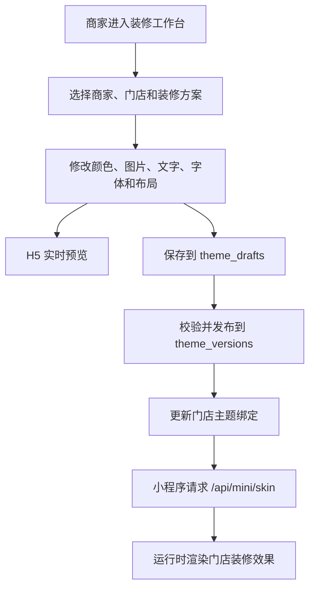

# 商家装修功能开发日志

## 开发时间

| 时间 | 本阶段完成内容 |
| --- | --- |
| 2026-08-17 | 完成商家装修基础功能，包括装修工作台、主题配置、草稿保存、版本发布、门店绑定、H5 预览和顾客小程序主题加载 |
| 2026-08-23 | 完成装修增强功能，包括素材与字体、AI 背景、艺术字、商品图、轮播图、布局预设和相关测试文档 |

## 功能流程图



商家装修采用配置驱动方式。商家修改的是一份 `SkinConfig` JSON，不是重新生成小程序代码。草稿保存后不会影响顾客，只有发布版本并更新门店绑定后，顾客小程序才会读取新装修。

## 2026-08-17：完成商家装修基础功能

### 1. 装修工作台和主题配置

开发了商家装修工作台，支持选择商家、门店、装修方案和系统模板，并可以修改页面颜色、背景、组件图片和文案。

用户修改控件后，页面会更新 `state.config`，标记为未保存状态，并通过 `postMessage` 把配置发送给 uni-app H5 页面实时预览。

对应功能是：装修页面、主题模板、配置编辑和 H5 实时预览。

代码：

- [workbench.html](../../../src/main/resources/templates/coffee/decorator/workbench.html)
- [DecoratorWorkbenchController.java](../../../src/main/java/com/ruoyi/project/coffee/decorator/api/DecoratorWorkbenchController.java)
- [preview-bridge.js](../../../RuoYi-AbuCoder-UniAppWx/Ruoyi-AbuCoder-UniApp-WX/theme/preview-bridge.js)

### 2. 草稿保存和发布版本

开发了手动保存和 800 毫秒防抖自动保存功能，装修配置保存在 `theme_drafts.config_json` 中。

保存时会校验用户权限、配置格式、素材归属和草稿 `revision`。如果草稿已经被其他窗口修改，系统返回 `THEME_DRAFT_CONFLICT`，防止旧数据覆盖新数据。

点击发布后，系统会再次校验草稿，生成不可修改的 `theme_versions` 记录，并通过幂等键防止重复点击产生多个版本。

对应功能是：草稿保存、自动保存、并发冲突控制、发布校验和版本记录。

代码：

- [DecoratorThemeController.java](../../../src/main/java/com/ruoyi/project/coffee/decorator/api/DecoratorThemeController.java)
- [DecoratorThemeService.java](../../../src/main/java/com/ruoyi/project/coffee/decorator/theme/DecoratorThemeService.java)
- [ThemeConfigValidator.java](../../../src/main/java/com/ruoyi/project/coffee/decorator/theme/ThemeConfigValidator.java)

### 3. 商家统一装修和门店独立装修

开发了商家统一主题、门店跟随和门店独立装修功能。

普通门店使用 `FOLLOW_MERCHANT` 模式，商家统一主题发布后自动更新；特殊门店可以复制当前线上版本创建独立草稿，切换为 `INDEPENDENT` 模式后单独编辑和发布，不再被统一主题覆盖。

对应功能是：商家统一品牌装修、门店继承、独立门店主题和重新跟随统一主题。

代码：

- [DecoratorThemeService.java](../../../src/main/java/com/ruoyi/project/coffee/decorator/theme/DecoratorThemeService.java)
- [DecoratorThemeMapper.xml](../../../src/main/resources/mybatis/coffee/decorator/DecoratorThemeMapper.xml)
- [coffee_theme_scope_v2.sql](../../../sql/coffee_theme_scope_v2.sql)

### 4. 顾客小程序加载装修主题

开发了顾客端主题接口和小程序主题运行时。顾客进入门店后，小程序请求：

```http
GET /api/mini/skin?storeId={storeCode}
```

接口返回门店当前发布版本、装修配置、素材地址和字体资源。`runtime.js` 将配置转换成页面颜色、背景、图片和文字样式，并按门店和版本进行本地缓存。

对应功能是：门店主题查询、小程序主题加载、配置规范化和异常降级。

代码：

- [CustomerThemeController.java](../../../src/main/java/com/ruoyi/project/coffee/decorator/api/CustomerThemeController.java)
- [theme.js](../../../RuoYi-AbuCoder-UniAppWx/Ruoyi-AbuCoder-UniApp-WX/api/theme.js)
- [runtime.js](../../../RuoYi-AbuCoder-UniAppWx/Ruoyi-AbuCoder-UniApp-WX/theme/runtime.js)

## 2026-08-23：完成装修增强功能

### 1. 素材、轮播图、商品图和字体

开发了商家素材库、组件背景、首页轮播图、商品装修图和字体资源功能。主题配置只保存素材 ID，接口通过 `assetUrls` 和 `fontResources` 返回实际资源地址。

已发布版本正在使用的素材不能直接停用，避免顾客端图片失效。商品装修图只影响展示，不修改商品业务表中的原始图片。

对应功能是：素材上传、素材引用、轮播图、商品图和商家字体。

代码：

- [DecoratorAssetController.java](../../../src/main/java/com/ruoyi/project/coffee/decorator/api/DecoratorAssetController.java)
- [DecoratorAssetService.java](../../../src/main/java/com/ruoyi/project/coffee/decorator/asset/DecoratorAssetService.java)
- [DecoratorFontService.java](../../../src/main/java/com/ruoyi/project/coffee/decorator/font/DecoratorFontService.java)
- [font-loader.js](../../../RuoYi-AbuCoder-UniAppWx/Ruoyi-AbuCoder-UniApp-WX/theme/font-loader.js)

### 2. AI 背景、艺术字和商品图

开发了 AI 纯背景、带文案背景、透明艺术字和商品装修图生成功能。

系统根据组件类型限制生成尺寸、文案和图片用途。生成结果先作为候选图预览，用户接受后才转为正式素材并应用到草稿。首页轮播支持批量应用，最多保存 10 张图片。

AI 类型包括：

```text
BACKGROUND           纯背景图
BACKGROUND_WITH_TEXT 带文案背景图
ART_TEXT              透明艺术字
PRODUCT_IMAGE         商品装修图
```

对应功能是：AI 任务创建、图片生成、尺寸校验、候选预览、接受和应用。

代码：

- [DecoratorAiController.java](../../../src/main/java/com/ruoyi/project/coffee/decorator/api/DecoratorAiController.java)
- [DecoratorAiService.java](../../../src/main/java/com/ruoyi/project/coffee/decorator/ai/DecoratorAiService.java)
- [DecoratorImageProcessor.java](../../../src/main/java/com/ruoyi/project/coffee/decorator/ai/DecoratorImageProcessor.java)
- [DecoratorPromptBuilder.java](../../../src/main/java/com/ruoyi/project/coffee/decorator/ai/DecoratorPromptBuilder.java)

### 3. 文字样式、艺术字位置和布局预设

开发了文字角色样式、字体、字号、颜色、字重、文字阴影、艺术字位置和尺寸预设。

商家不能提交任意坐标、宽高或可执行代码，只能使用系统注册的布局和艺术字预设，保证 H5 与微信小程序中的显示结果一致。

对应功能是：文字样式、受约束布局和安全配置校验。

代码：

- [typography-registry.js](../../../RuoYi-AbuCoder-UniAppWx/Ruoyi-AbuCoder-UniApp-WX/theme/typography-registry.js)
- [layout-registry.js](../../../RuoYi-AbuCoder-UniAppWx/Ruoyi-AbuCoder-UniApp-WX/theme/layout-registry.js)
- [decoration-registry.js](../../../RuoYi-AbuCoder-UniAppWx/Ruoyi-AbuCoder-UniApp-WX/theme/decoration-registry.js)
- [ThemeConfigValidator.java](../../../src/main/java/com/ruoyi/project/coffee/decorator/theme/ThemeConfigValidator.java)

## 数据库内容

| 表名 | 作用 |
| --- | --- |
| `themes` | 保存装修方案名称和商家/门店作用域 |
| `theme_drafts` | 保存当前未发布草稿和 revision |
| `theme_versions` | 保存发布后不可修改的版本 |
| `store_theme_bindings` | 保存门店当前使用的主题版本 |
| `assets` / `theme_asset_refs` | 保存素材和主题素材引用 |
| `font_resources` | 保存字体资源 |
| `ai_generation_tasks` / `ai_generation_results` | 保存 AI 任务和候选结果 |
| `theme_preview_sessions` | 保存短期真机预览快照 |

数据库脚本：

- [coffee_theme_decorator.sql](../../../sql/coffee_theme_decorator.sql)
- [coffee_skin_v1.sql](../../../sql/coffee_skin_v1.sql)
- [coffee_decorator_v2_assets_fonts_ai.sql](../../../sql/coffee_decorator_v2_assets_fonts_ai.sql)

## 测试结果

本次实际运行商家装修相关自动化测试：

```text
测试类：15
测试用例：77
失败：0
错误：0
跳过：0
```

测试覆盖草稿冲突、发布幂等、门店绑定、配置校验、素材隔离、字体引用、AI 图片尺寸、艺术字透明通道和顾客端主题接口。

当前已完成 H5 iframe 实时预览；真机预览后端接口和数据表已经完成，但工作台中的真机预览按钮尚未接入。

## 总结

2026 年 8 月 17 日完成了商家装修的基础闭环：编辑、预览、保存、发布、门店绑定和小程序加载。

2026 年 8 月 23 日完成了装修增强功能：素材、字体、轮播图、商品图、AI 背景、艺术字和受约束布局。

